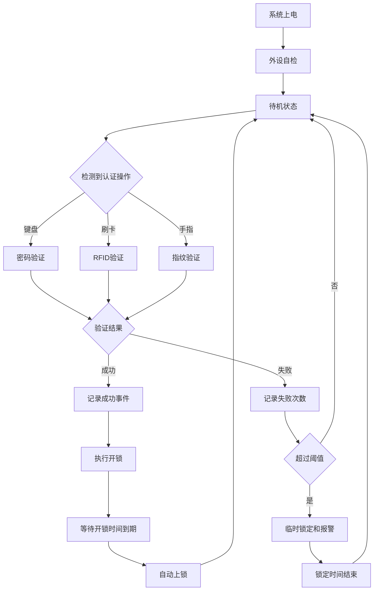

# STM32F103智能门锁离线控制系统开发文档

> 文档编号：SDLK-SDP-001  
> 文档版本：V1.5
> 文档状态：阶段0～6已实现并完成自动验证，实物待验
> 目标平台：STM32F103C8T6开发板  
> 当前阶段：离线门锁控制系统  
> 后续扩展：ESP32 Wi-Fi/BLE、4G通信、Linux/ESP32-S3人脸识别模块  
> 最后更新：2026-10-05

---

## 文档控制

### 修订记录

| 文档版本 | 日期 | 修订内容 | 作者/责任人 | 审核状态 |
|---|---|---|---|---|
| V1.0 | 2026-10-03 | 建立离线门锁开发基线 | 项目开发者 | 初稿 |
| V1.1 | 2026-10-03 | 增加企业化流程、Git、编码、注释、评审、测试和发布规范 | 项目开发者 | 待执行验证 |
| V1.2 | 2026-10-03 | 按已确认硬件更新STM32资源、I²C总线、RTC、存储和电磁锁方案 | 项目开发者 | 硬件基线部分确认 |
| V1.3 | 2026-10-04 | 确认SSD1315 OLED、AS608 3.3V供电及DS3231无充电电路，更新驱动和接线约束 | 项目开发者 | 核心供电基线确认 |
| V1.4 | 2026-10-04 | 冻结CubeMX、Keil MDK、HAL、ST-Link/SWD、USART1及三层Git分支模型 | 项目开发者 | 开发环境基线确认 |
| V1.5 | 2026-10-05 | 同步阶段0～6实现、AT24C02实际布局、AS608异步状态机、管理员菜单、失败锁定与IWDG证据 | 项目开发者 | AUTO/REVIEW通过，PENDING-HW |

### 文档维护规则

- 本文档与代码一起纳入Git版本管理。
- 需求、接口、存储布局、通信协议或发布流程发生变化时，必须同步更新本文档。
- 修改本文档应使用`feature/DOC-*`分支，并在合并前完成文档自检。
- 已发布版本对应的文档不得直接修改；修订后必须形成新的文档版本。
- 文档中的“必须”“禁止”“应当”“建议”分别表示强制要求、禁止要求、默认要求和可选改进。
- 实际项目若偏离本文档中的强制要求，必须记录偏离原因、风险和补偿措施。

### 参考规范

本项目不宣称达到功能安全或量产认证，但开发过程参考以下行业实践：

- MISRA C:2023的安全、可分析和可移植C语言思想。
- Doxygen结构化API注释格式。
- Conventional Commits 1.0.0提交格式。
- Semantic Versioning 2.0.0版本号格式。
- Git短生命周期主题分支和合并评审流程。

项目参考规范链接：

- [MISRA官方网站](https://misra.org.uk/)
- [Doxygen代码注释说明](https://www.doxygen.nl/manual/docblocks.html)
- [Conventional Commits 1.0.0](https://www.conventionalcommits.org/zh-hans/v1.0.0/)
- [Semantic Versioning 2.0.0](https://semver.org/lang/zh-CN/)
- [Git工作流文档](https://git-scm.com/docs/gitworkflows.html)

### 开发环境基线

以下环境作为本项目正式开发基线，除非通过文档变更评审，否则不得在开发过程中随意切换工具链或固件库：

| 类别 | 冻结选择 | 项目要求 |
|---|---|---|
| 主控 | STM32F103C8T6 | 按64KB Flash、20KB SRAM、最高72MHz设计 |
| 工程生成工具 | STM32CubeMX | `.ioc`文件必须纳入Git，外设变更优先通过CubeMX维护 |
| 开发环境 | Keil MDK | CubeMX的Toolchain/IDE选择`MDK-ARM` |
| 固件库 | STM32 HAL | 使用CubeMX生成的STM32F1 HAL/CMSIS，不在业务层直接依赖寄存器细节 |
| 下载调试 | ST-Link + SWD | 保留PA13/SWDIO、PA14/SWCLK，建议同时引出NRST和GND |
| 调试输出 | USART1 | PA9作为TX，默认115200、8N1；PA10 RX按需启用 |
| Git分支模型 | `main + develop + feature/*` | `main`保存已验证版本，`develop`负责集成，所有任务在`feature/*`完成 |

首次建立工程时还必须记录实际安装版本：

- STM32CubeMX版本。
- STM32CubeF1固件包版本。
- Keil MDK版本。
- Arm Compiler版本及选择的是Compiler 5还是Compiler 6。
- ST-Link固件版本。

上述版本记录放入README或`Docs/toolchain.md`。同一发布周期内不得无记录升级编译器、HAL包或CubeMX；确需升级时，应在独立`feature/*`分支完成全量编译和硬件回归测试。

---

## 1. 文档目的

本文档用于指导智能门锁毕业设计的硬件搭建、STM32固件开发、模块联调、功能测试和后续扩展。

当前阶段以“可靠的离线门锁控制器”为核心，不立即加入联网和人脸识别。首先完成密码、RFID、指纹三种本地认证方式，使系统即使在网络断开、外部智能模块失效的情况下，仍然能够完成正常开锁和管理员操作。

本文档当前硬件基线：

- STM32F103C8T6开发板，型号已由用户确认。
- 4×4矩阵键盘。
- MFRC522/RC522 13.56MHz RFID射频模块，使用SPI。
- AS608光学指纹模块，3.3V供电，使用TTL UART；连接器线序和UART高电平仍需按实物确认。
- 0.96英寸白色OLED，128×64，SSD1315控制器，四线I²C，默认7位地址`0x3C`。
- AT24C02 I²C EEPROM，容量2Kbit，即256字节。
- DS3231 HW-084 I²C实时时钟模块，安装CR2032；D2/R4疑似充电支路，待万用表确认。
- LYO3C电磁锁，DC 12V、0.4A，可持续通电。
- 锁驱动优先采用3.3V逻辑电平MOSFET，不由STM32直接驱动。
- 蜂鸣器、状态灯、门磁传感器和出门按钮为推荐扩展。

STM32F103C8T6官方资源基线为64KB Flash、20KB SRAM、最高72MHz，不以部分非官方开发板可能存在的额外Flash作为设计依据。AS608连接器线序和峰值电流、电磁锁通电动作逻辑、DS3231电池具体型号及开发板稳压器能力仍需通过实物确认。

---

## 2. 项目范围

### 2.1 当前版本必须实现的功能

1. 密码开锁。
2. RFID授权卡开锁。
3. 指纹开锁。
4. OLED状态显示和菜单交互。
5. AT24C02掉电保存精简配置和少量用户映射。
6. 验证成功后开锁，并在设定时间后自动上锁。
7. 连续验证失败达到阈值后临时锁定。
8. 管理员模式。
9. 添加、删除RFID卡。
10. 录入、删除指纹编号。
11. 修改密码。
12. 蜂鸣器和状态灯提示。
13. 基本异常处理和看门狗保护。
14. DS3231提供离线日期和时间。
15. 为后续联网和人脸识别预留UART协议。

### 2.2 推荐实现的增强功能

- 门磁检测。
- 出门按钮。
- 门长时间未关闭报警。
- 非法开门报警。
- 增加外部W25Qxx后实现开锁记录循环存储。
- 管理员和普通用户权限区分。
- 使用DS3231时间戳记录事件。
- 双份配置和CRC校验。
- 低电压或掉电异常处理。

### 2.3 当前阶段暂不实现

- 手机App。
- 云平台。
- 4G通信。
- 远程开锁。
- 人脸识别。
- 视频录像。
- 云端用户数据库。

这些功能只预留硬件和软件接口，不应影响当前离线版本的开发进度。

---

## 3. 系统总体设计

### 3.1 系统框图

```text
                              ┌──────────────────────┐
4×4矩阵键盘 ───── GPIO ──────>│                      │
RC522 RFID ─────── SPI ───────>│                      │
指纹模块 ───────── UART ──────>│                      │
OLED ───────────── I²C ───────>│     STM32F103        │
AT24C02 EEPROM ─── I²C ───────>│                      │
DS3231 RTC ─────── I²C ───────>│                      │
门磁/出门按钮 ──── GPIO/EXTI ─>│                      │
                              │                      │
                              │              GPIO ───┼──> 蜂鸣器/状态灯
                              │              GPIO ───┼──> MOSFET/继电器 ──> 电磁锁
                              │              UART ───┼──> 预留ESP32/人脸模块
                              └──────────────────────┘
```

### 3.2 控制原则

- STM32是门锁的最终控制器。
- RFID、指纹、未来的人脸模块只提供认证结果，不能直接驱动电磁锁。
- 网络失效不能影响密码、RFID和指纹开锁。
- STM32上电、复位或异常时，门锁输出必须进入预定的安全状态。
- 所有耗时操作必须设置超时，避免系统永久阻塞。
- 电磁锁控制不得使用长时间阻塞式延时。

### 3.3 认证流程



---

## 4. 硬件设计

## 4.1 模块清单

| 模块 | 建议接口 | 典型电压 | 作用 |
|---|---|---:|---|
| STM32F103C8T6开发板 | — | 芯片2.0～3.6V，开发板通常5V输入 | 主控制器，64KB Flash/20KB SRAM |
| 4×4矩阵键盘 | 8路GPIO | 3.3V逻辑 | 密码输入、菜单操作 |
| MFRC522/RC522 | SPI | 3.3V | RFID读卡，SPI从机 |
| AS608指纹模块 | USART2 | 3.3V | 模块内部完成录入、特征和搜索 |
| SSD1315 OLED | I²C1 | 3.3V | 0.96英寸、128×64、默认7位地址0x3C |
| AT24C02 | I²C1 | 3.3V | 256字节掉电存储，8字节页写 |
| DS3231 | I²C1 | 建议3.3V | RTC，7位地址0x68 |
| LYO3C电磁锁 | MOSFET电源开关 | DC12V/0.4A | 负载约4.8W，可持续通电 |
| MOSFET或继电器 | GPIO控制 | 3.3V控制侧 | 驱动电磁锁 |
| 蜂鸣器 | GPIO/PWM | 3.3V/5V | 提示和报警 |
| 门磁传感器 | GPIO/EXTI | 3.3V逻辑 | 检测门开关状态 |
| 出门按钮 | GPIO/EXTI | 3.3V逻辑 | 室内开门 |

### 4.2 推荐引脚分配

以下方案以STM32F103C8T6为例。实际接线前必须与开发板原理图核对。

| 功能 | STM32引脚 | 外设配置 | 备注 |
|---|---|---|---|
| OLED SCK/SCL | PB6 | I²C1_SCL | SSD1315，与AT24C02、DS3231共用总线 |
| OLED SDA | PB7 | I²C1_SDA | 默认7位地址0x3C，模块自带4.7kΩ上拉 |
| AT24C02 SCL/SDA | PB6/PB7 | I²C1 | A0～A2为低时7位地址通常为0x50 |
| DS3231 SCL/SDA | PB6/PB7 | I²C1 | 7位地址0x68 |
| DS3231 INT/SQW | PA0，可选 | GPIO/EXTI0 | 第一版可不连接，轮询读取时间 |
| RC522 NSS/SDA | PA4 | GPIO输出 | SPI片选 |
| RC522 SCK | PA5 | SPI1_SCK | 先使用较低速率调试 |
| RC522 MISO | PA6 | SPI1_MISO | 3.3V逻辑 |
| RC522 MOSI | PA7 | SPI1_MOSI | 3.3V逻辑 |
| RC522 RST | PB0 | GPIO输出 | 复位控制 |
| AS608 TX | PA3 | USART2_RX | 模块3.3V供电；TX接MCU RX，高电平首次接线时实测 |
| AS608 RX | PA2 | USART2_TX | 模块RX接MCU TX，8N1 |
| 调试串口TX | PA9 | USART1_TX | 连接USB转串口RX |
| 调试串口RX | PA10 | USART1_RX | 可选 |
| 键盘R1～R4 | PB8～PB11 | GPIO输出 | 行扫描 |
| 键盘C1～C4 | PB12～PB15 | GPIO输入上拉 | 列检测 |
| LYO3C控制 | PA8 | GPIO/TIM1_CH1 | 只连接MOSFET Gate驱动，不能直接接锁 |
| 蜂鸣器 | PB1 | GPIO或PWM | 有源蜂鸣器用GPIO即可 |
| 门磁 | 后续重新分配 | GPIO/EXTI | PA0优先预留给DS3231 INT/SQW |
| 出门按钮 | PA1 | GPIO/EXTI1 | 可选 |
| SWDIO | PA13 | SWD | 保留 |
| SWCLK | PA14 | SWD | 保留 |

注意事项：

- PA13和PA14必须保留给SWD下载调试。
- 如果使用完整JTAG，PA15、PB3和PB4也会被占用；建议CubeMX中选择Serial Wire释放这些引脚。
- PB8～PB15整组用于键盘便于扫描，但后期若引脚不足，可增加74HC165、PCF8574等扩展器。
- AS608供电固定为3.3V；UART先按57600、8N1通信测试，线序和输出高电平仍需实测。
- 部分模块丝印中的“SDA”实际是SPI片选，不代表I²C数据线，RC522模块尤其需要注意。
- OLED、AT24C02和DS3231共享I²C1；OLED原理图已确认SCL/SDA各带4.7kΩ上拉，焊接前还应测量三块模块并联后的总线等效上拉，避免阻值过低。

### 4.3 电源设计

推荐电源结构：

```text
12V直流输入，建议原型阶段使用12V/2A适配器
 ├── 保险丝/自恢复保险丝
 ├── 反接保护
 ├── TVS或适当浪涌保护
 ├── 经MOSFET功率回路供给LYO3C 12V/0.4A电磁锁
 └── DC-DC降压到5V
       ├── STM32开发板5V输入
       └── 3.3V稳压
             ├── STM32
             ├── RC522
             ├── OLED
             ├── AT24C02
             ├── DS3231
             ├── AS608
             └── 外部W25Qxx，后续可选
```

必须遵守：

1. 不能从STM32 GPIO直接驱动电磁锁。
2. 电磁锁应使用独立的功率回路。
3. 未使用光耦隔离时，控制地与功率地需要正确共地。
4. 电磁锁两端并联续流二极管，二极管方向必须保证正常通电时反向截止。
5. STM32、RC522、OLED附近放置0.1μF退耦电容。
6. 电源入口和锁驱动附近增加适当的电解电容。
7. 电磁锁电源线和SPI、I²C等信号线尽量分开布置。
8. 电磁锁吸合和释放时测试STM32是否复位、OLED是否闪屏、RFID是否掉线。

LYO3C额定负载为12V×0.4A=4.8W。考虑控制板、AS608和后续扩展，12V电源额定电流不应只按0.4A选择；原型阶段建议使用12V/2A并在实测后确认余量。锁允许持续通电不代表软件应无限持续驱动，仍要根据实际“通电开锁/通电上锁”逻辑设置最长动作时间和故障保护。

### 4.4 电磁锁驱动

#### 方案A：N沟道MOSFET低端驱动

推荐用于直流电磁锁：

```text
STM32 GPIO ── 栅极电阻 ── MOSFET Gate
                              │
                            下拉电阻
                              │
                             GND

12V ── 电磁锁 ── MOSFET Drain
MOSFET Source ── GND

电磁锁两端反向并联续流二极管
```

MOSFET必须是3.3V栅极可充分导通的逻辑电平器件。不能只看阈值电压，应查看数据手册在VGS=2.5V或3.3V附近的导通电阻指标。

#### 方案B：继电器模块

优点是接线直观，缺点是机械寿命、噪声、体积和驱动电流相对较大。需要确认：

- 输入端是否兼容3.3V。
- 模块是高电平触发还是低电平触发。
- 上电默认状态是否会误开锁。
- 继电器触点电流额定值是否满足电磁锁要求。

### 4.5 门锁类型确认

开发前必须确认电磁锁属于哪种逻辑：

- 通电上锁、断电开锁，常见于磁力锁，偏向消防逃生安全。
- 通电开锁、断电上锁，常见于部分电控锁，偏向断电保持闭锁。

软件中的`LOCK_ACTIVE_LEVEL`应配置化，不能将输出电平写死在业务代码里。

---

## 5. STM32CubeMX基础配置

### 5.1 工程和工具链配置

在STM32CubeMX中创建STM32F103C8T6工程，工程生成配置固定为：

| 配置项 | 基线值 |
|---|---|
| MCU | STM32F103C8T6 |
| Toolchain/IDE | MDK-ARM |
| 固件库 | STM32CubeF1 HAL |
| 调试接口 | Serial Wire |
| 工程字符编码 | 项目自有源码和文档统一UTF-8 |
| 用户代码保护 | 启用重新生成时保留User Code |

CubeMX生成规则：

- `.ioc`是外设和时钟配置的唯一配置基线，必须提交Git。
- CubeMX自动生成文件中的手工代码只能写在`USER CODE BEGIN/END`保护区。
- 业务状态机、设备驱动封装和服务层代码放在独立文件中，避免重新生成工程时被覆盖。
- 每次重新生成后必须检查Git差异、重新编译并执行最小硬件回归。
- Keil工程文件`.uvprojx`应提交Git，以便在其他电脑上直接打开工程。
- Keil用户界面状态、临时编译目录和普通构建产物不作为源码提交。

Keil MDK至少建立两种构建配置：

| 配置 | 用途 | 要求 |
|---|---|---|
| Debug | 日常下载、断点和日志调试 | 生成调试信息，优化等级保持便于调试，启用编译警告 |
| Release | 阶段验收和发布 | 固定优化等级，关闭无必要调试输出，保存HEX/BIN/AXF、Map和构建记录 |

编译器版本和优化等级必须记录；不得在没有全量回归测试的情况下从Arm Compiler 5切换到Arm Compiler 6，或反向切换。

### 5.2 系统配置

- Debug选择Serial Wire。
- 根据开发板晶振配置RCC。
- 常见F103系统时钟配置为72MHz。
- SysTick保持1ms时基，或使用独立定时器作为应用节拍。
- 开启USART1作为调试串口。
- 后期启用独立看门狗IWDG。

### 5.3 外设建议

| 外设 | 建议配置 |
|---|---|
| USART1 | 115200、8N1、调试日志 |
| USART2 | AS608暂按57600、8N1配置，通信验证后冻结 |
| SPI1 | Master、8bit、Mode 0，RC522调通后再提高速度 |
| I²C1 | OLED、AT24C02、DS3231共享；100kHz起步，稳定后再评估400kHz |
| GPIO | 键盘行输出、列输入上拉、锁输出、蜂鸣器输出 |
| EXTI | 门磁和出门按钮，可选 |
| TIM | 蜂鸣器PWM或周期任务，可选 |
| IWDG | 所有模块稳定后再开启 |

### 5.4 GPIO初始状态

门锁控制引脚必须在系统初始化的最早阶段进入安全电平。

推荐顺序：

1. 初始化HAL和时钟。
2. 初始化门锁GPIO并立即设置安全状态。
3. 初始化调试串口。
4. 初始化I²C、SPI和USART2。
5. 扫描I²C总线并初始化OLED、AT24C02和DS3231。
6. 从AT24C02读取配置，并检查DS3231时间是否有效。
7. 初始化MFRC522和AS608。
8. OLED显示自检结果。
9. 进入正常状态机。

---

## 6. 软件架构

### 6.1 分层结构

```text
Application
 ├── app_system       系统状态机
 ├── app_auth         统一认证
 ├── app_user         用户和权限管理
 ├── app_admin        管理员菜单
 ├── app_security     失败锁定和报警
 ├── app_ui           界面逻辑
 └── app_log          开锁记录

Services
 ├── storage          EEPROM数据管理
 ├── event            事件分发
 ├── soft_timer       软件定时器
 └── protocol         后续联网通信协议

Drivers/BSP
 ├── bsp_keypad
 ├── bsp_oled
 ├── bsp_eeprom
 ├── bsp_rc522
 ├── bsp_fingerprint
 ├── bsp_lock
 ├── bsp_buzzer
 └── bsp_door_sensor

HAL/CMSIS
 └── STM32Cube生成代码
```

### 6.2 推荐目录

```text
SmartDoorLock/
├── Core/
│   ├── Inc/
│   └── Src/
├── Drivers/
├── BSP/
│   ├── Inc/
│   └── Src/
├── App/
│   ├── Inc/
│   └── Src/
├── Services/
│   ├── Inc/
│   └── Src/
├── Protocol/
├── Docs/
└── Tests/
```

### 6.3 模块职责原则

- 驱动层只负责硬件操作，不直接作出开锁决定。
- 认证层将不同认证方式统一为相同结果格式。
- 状态机决定当前允许执行的操作。
- 存储层集中管理EEPROM地址，不允许各模块随意写EEPROM。
- UI层只显示状态，不直接修改用户数据。
- 所有模块返回明确错误码，不使用大量无意义的`true/false`隐藏错误原因。

---

## 7. 主循环与非阻塞调度

### 7.1 主循环建议

第一版不必立即使用RTOS。STM32F103控制功能使用前后台循环即可完成：

```c
int main(void)
{
    HAL_Init();
    SystemClock_Config();

    MX_GPIO_Init();
    Door_ForceSafeState();

    MX_USART1_UART_Init();
    MX_USART2_UART_Init();
    MX_I2C1_Init();
    MX_SPI1_Init();

    App_Init();

    while (1)
    {
        Keypad_Task();
        RFID_Task();
        Fingerprint_Task();
        Door_Task();
        DoorSensor_Task();
        Security_Task();
        Storage_Task();
        UI_Task();
        Protocol_Task();
        App_Task();

        Watchdog_FeedIfHealthy();
    }
}
```

### 7.2 禁止长阻塞

不推荐：

```c
Door_UnlockOutput();
HAL_Delay(5000);
Door_LockOutput();
```

推荐：

```c
void Door_Unlock(uint32_t duration_ms)
{
    g_door.state = DOOR_UNLOCKED;
    g_door.deadline = HAL_GetTick() + duration_ms;
    Door_SetOutput(DOOR_OUTPUT_UNLOCK);
}

void Door_Task(void)
{
    uint32_t now = HAL_GetTick();

    if (g_door.state == DOOR_UNLOCKED &&
        (int32_t)(now - g_door.deadline) >= 0)
    {
        Door_Lock();
    }
}
```

使用带符号差值判断时间，可以正确处理`HAL_GetTick()`约49天回绕的问题。

### 7.3 建议任务周期

| 任务 | 建议周期 | 说明 |
|---|---:|---|
| Keypad_Task | 5～10ms | 扫描和消抖 |
| DoorSensor_Task | 10～20ms | 门磁消抖 |
| RFID_Task | 30～100ms | 轮询寻卡 |
| Fingerprint_Task | 20～100ms | 状态机推进 |
| Door_Task | 5～20ms | 自动上锁 |
| UI_Task | 50～200ms | 避免频繁刷新OLED |
| Storage_Task | 按需 | 异步写入和延迟合并 |
| Security_Task | 50～200ms | 锁定倒计时 |
| Protocol_Task | 尽可能频繁 | 接收联网模块数据 |

---

## 8. 系统状态机

### 8.1 状态定义

```c
typedef enum
{
    SYS_STATE_BOOT = 0,
    SYS_STATE_SELF_TEST,
    SYS_STATE_IDLE,
    SYS_STATE_PASSWORD_INPUT,
    SYS_STATE_RFID_VERIFY,
    SYS_STATE_FINGER_VERIFY,
    SYS_STATE_AUTH_SUCCESS,
    SYS_STATE_AUTH_FAILED,
    SYS_STATE_UNLOCKED,
    SYS_STATE_LOCKOUT,
    SYS_STATE_ADMIN_AUTH,
    SYS_STATE_ADMIN_MENU,
    SYS_STATE_ERROR
} SystemState;
```

### 8.2 状态转换规则

| 当前状态 | 事件 | 下一个状态 | 动作 |
|---|---|---|---|
| BOOT | 初始化完成 | SELF_TEST | 检查外设 |
| SELF_TEST | 必要外设正常 | IDLE | 显示待机界面 |
| IDLE | 按A键 | PASSWORD_INPUT | 清空输入缓存 |
| IDLE | 检测到卡片 | RFID_VERIFY | 读取UID |
| IDLE | 检测到手指 | FINGER_VERIFY | 启动搜索 |
| 任一认证状态 | 成功 | AUTH_SUCCESS | 清除失败计数 |
| 任一认证状态 | 失败 | AUTH_FAILED | 增加失败计数 |
| AUTH_SUCCESS | 提示完成 | UNLOCKED | 打开门锁 |
| UNLOCKED | 到期 | IDLE | 自动上锁 |
| AUTH_FAILED | 未超阈值 | IDLE | 显示失败 |
| AUTH_FAILED | 超过阈值 | LOCKOUT | 报警并锁定 |
| LOCKOUT | 锁定时间结束 | IDLE | 清除临时状态 |
| IDLE | 长按B键 | ADMIN_AUTH | 管理员认证 |
| ADMIN_AUTH | 成功 | ADMIN_MENU | 显示菜单 |
| ADMIN_MENU | 超时/退出 | IDLE | 保存必要配置 |

### 8.3 统一认证结果

```c
typedef enum
{
    AUTH_TYPE_NONE = 0,
    AUTH_TYPE_PASSWORD,
    AUTH_TYPE_RFID,
    AUTH_TYPE_FINGERPRINT,
    AUTH_TYPE_FACE,
    AUTH_TYPE_REMOTE,
    AUTH_TYPE_EXIT_BUTTON
} AuthType;

typedef enum
{
    AUTH_STATUS_PENDING = 0,
    AUTH_STATUS_SUCCESS,
    AUTH_STATUS_FAILED,
    AUTH_STATUS_TIMEOUT,
    AUTH_STATUS_DEVICE_ERROR
} AuthStatus;

typedef struct
{
    AuthType type;
    AuthStatus status;
    uint16_t user_id;
    uint16_t detail_code;
} AuthResult;
```

这样后续接入人脸或远程认证时，不需要重写门锁状态机。

---

## 9. OLED界面设计

### 9.1 SSD1315硬件与驱动基线

OLED资料基线位于`资料/OLED`。当前驱动按以下参数实现：

| 项目 | 冻结值 |
|---|---|
| 模块 | 2864KLWEG01，0.96英寸白色OLED |
| 控制器 | SSD1315 |
| 分辨率 | 128×64，1bit单色 |
| 接口 | 四线I²C：GND/VSS、VDD、SCK/SCL、SDA |
| 供电 | 3.3V，不接5V |
| 7位I²C地址 | `0x3C` |
| STM32 HAL地址形式 | `0x3C << 1`，即`0x78` |
| I²C上拉 | 模块原理图中SCL和SDA各带4.7kΩ上拉到VDD |

模块规格书中有一处方框图标注SSD1306，但同一资料包内的功能特性、SSD1315控制器手册和测试例程均指向SSD1315，因此项目驱动以SSD1315为准。若初始化失败，应报告`ERR_OLED_NOT_FOUND`，不得静默切换成其他控制器初始化序列。

驱动实现要求：

- 命令与显示数据通过独立底层接口发送，业务层不直接操作I²C控制字节。
- 业务层统一保存7位地址`0x3C`，只在HAL适配层左移为`0x78`，避免地址重复左移。
- 启动时先执行I²C设备就绪检查，再发送SSD1315初始化序列。
- 128×64全屏缓存为`128 × 64 ÷ 8 = 1024`字节，必须计入20KB SRAM预算。
- 第一版可以使用1KB单缓冲；禁止无评估增加双缓冲，以免额外占用1KB SRAM。
- 优先按页面或脏区更新，页面内容未变化时不重复发送整屏数据。
- 初始化后测试全灭、全亮、棋盘格、边框和文字，确认列、页、翻转方向及显示范围正确。

资料来源：

- `资料/OLED/规格书与控制芯片手册/规格书与控制芯片手册/0.96-4pin模块(新款)规格书.pdf`
- `资料/OLED/规格书与控制芯片手册/规格书与控制芯片手册/SSD1315.pdf`
- `资料/OLED/0.96-IIC(新款)-SCH原理图.pdf`
- `资料/OLED/0.96OLED测试例程`

### 9.2 界面列表

1. 启动画面。
2. 外设自检画面。
3. 待机画面。
4. 密码输入画面。
5. RFID读取画面。
6. 指纹识别画面。
7. 认证成功画面。
8. 认证失败画面。
9. 门锁已打开画面。
10. 临时锁定倒计时画面。
11. 管理员菜单。
12. 添加/删除用户画面。
13. 系统错误画面。

### 9.3 界面示例

```text
智能门锁
刷卡/指纹/密码
A:密码  B:管理
```

```text
请输入密码
******
*:删除  #:确认
```

```text
验证成功
欢迎 用户03
门锁已打开 5s
```

```text
验证失败
剩余机会：2
```

### 9.4 刷新策略

- 页面内容变化时才刷新。
- 倒计时可每秒刷新一次。
- 不要在主循环中无条件清屏和全屏重绘。
- OLED故障不应阻止本地认证和门锁控制。

---

## 10. 矩阵键盘设计

### 10.1 键位建议

```text
1  2  3  A
4  5  6  B
7  8  9  C
*  0  #  D
```

| 按键 | 功能 |
|---|---|
| 0～9 | 数字输入 |
| A | 进入密码模式 |
| B | 进入管理员认证 |
| C | 预留功能 |
| D | 取消/返回 |
| * | 删除一位 |
| # | 确认 |

### 10.2 扫描流程

1. 四行默认保持非激活电平。
2. 每次只激活一行。
3. 读取四列输入状态。
4. 组合得到原始键值。
5. 连续多次读取一致后确认按下。
6. 等待释放后才允许产生下一次按键事件。

### 10.3 消抖建议

- 扫描周期：5～10ms。
- 稳定时间：20～30ms。
- 普通按键只在按下边沿产生一次事件。
- 长按功能单独计时，例如按住B键2秒进入管理模式。
- 同时按下多个按键时，第一版可判为无效输入。

### 10.4 密码输入规则

- 密码长度建议6～8位。
- OLED只显示`*`。
- 输入超时建议15秒。
- 达到最大长度后拒绝继续输入。
- 比较完成后立即清空RAM中的密码输入缓冲区。
- 不在串口日志中输出真实密码。

---

## 11. MFRC522/RC522 RFID模块设计

### 11.1 第一阶段功能

- 使用3.3V供电，初始化MFRC522。
- 读取版本寄存器验证SPI通信。
- 寻卡。
- 防冲突。
- 获取卡片UID。
- 在授权卡表中查找UID。
- 输出统一认证结果。

### 11.2 建议接口

```c
typedef struct
{
    uint8_t bytes[10];
    uint8_t length;
} RfidUid;

bool RC522_Init(void);
bool RC522_IsPresent(void);
bool RC522_ReadUid(RfidUid *uid);
void RC522_Halt(void);
```

不要把UID长度永远写死为4字节。常见卡片可能存在4、7或10字节UID，应在数据结构中保留长度字段。

### 11.3 卡片管理

- 添加卡片时检查是否已存在。
- 删除卡片时检查目标是否存在。
- 每张卡关联用户ID、权限和启用状态。
- 管理员卡和普通卡可以设置不同权限。
- UID认证适合毕设演示，但不能宣称为高安全认证，因为部分卡片UID可以被复制。

---

## 12. AS608指纹模块设计

### 12.1 通信方式

AS608通过TTL UART数据包通信，当前模块供电固定为3.3V，禁止接5V。通信暂定USART2、57600bps、8数据位、1停止位、无校验；TX/RX连接为模块TX→PA3、模块RX←PA2。供电电压已确认，但连接器线序、TX高电平和峰值电流仍需在首次接线时核对或测量。

AS608内部完成图像采集、特征生成、模板合成和1:N搜索，STM32只负责发送命令、解析响应和管理用户编号。需要实现：

- 验证模块口令。
- 获取图像。
- 生成特征。
- 合并模板。
- 保存模板。
- 搜索模板库。
- 删除指定模板。
- 清空模板库。
- 查询模板数量。

常见AS608默认设备地址为`0xFFFFFFFF`、默认口令为`0x00000000`，但驱动不得把这些值散落为魔法数字，应集中放在配置中，并在首次通信时执行口令验证。

### 12.2 非阻塞状态机

不建议在一个函数中连续等待手指、采图、生成特征和搜索。建议设计：

```c
typedef enum
{
    FP_STATE_IDLE = 0,
    FP_STATE_WAIT_FINGER,
    FP_STATE_CAPTURE,
    FP_STATE_GENERATE,
    FP_STATE_SEARCH,
    FP_STATE_WAIT_RESPONSE,
    FP_STATE_SUCCESS,
    FP_STATE_FAILED,
    FP_STATE_TIMEOUT
} FingerprintState;
```

每次发送命令后记录超时时间，收到完整响应后再推进状态。

UART接收建议使用中断或DMA加环形缓冲区。数据包解析顺序为包头、设备地址、包标识、长度、数据和校验和；任何长度超限、地址不匹配或校验失败的数据包都必须丢弃，不能推进认证状态。

### 12.3 数据保存

- 指纹图像和模板保存在AS608内部Flash。
- AT24C02只保存少量指纹模板ID与系统用户ID之间的映射，当前上限规划为8条。
- 删除系统用户时，同时删除映射；是否删除模块中的模板由业务策略决定。
- 上电后可比较模块模板数量与EEPROM映射数量，发现不一致时提示管理员处理。

---

## 13. DS3231 RTC与AT24C02存储设计

### 13.1 已确认资源

| 器件 | 接口 | 资源 | 项目用途 |
|---|---|---|---|
| DS3231 | I²C1 | RTC、温度、闹钟、后备电池 | 提供离线日期和时间 |
| AT24C02 | I²C1 | 2Kbit，即256字节 | 精简配置、少量卡片和指纹映射 |

DS3231的7位I²C地址固定为`0x68`。AT24C02在A0～A2均为低电平时，7位地址通常为`0x50`。STM32 HAL部分API使用左移一位后的8位地址形式，代码必须统一封装，业务层不得同时混用`0x50`与`0xA0`两种表达方式。

### 13.2 DS3231驱动范围

第一阶段实现：

- 读取和设置秒、分、时、星期、日、月、年。
- 支持24小时制。
- BCD与二进制转换。
- 检查振荡器停止标志，判断时间是否可信。
- 读取温度，作为诊断信息而不是环境温度精密测量。
- 掉电后依靠模块后备电池继续计时。

第二阶段可实现：

- Alarm 1/Alarm 2。
- INT/SQW中断输出。
- 定时唤醒或维护任务。

第一版可以不连接INT/SQW，直接通过I²C按需读取时间。若使用INT/SQW，暂定连接PA0并配置外部中断；该输出为开漏形式，需要上拉到3.3V。

### 13.3 DS3231时间数据结构

```c
typedef struct
{
    uint16_t year;   /**< 2000～2099。 */
    uint8_t month;   /**< 1～12。 */
    uint8_t day;     /**< 1～31。 */
    uint8_t weekday; /**< 1～7，项目内统一定义起始日。 */
    uint8_t hour;    /**< 0～23。 */
    uint8_t minute;  /**< 0～59。 */
    uint8_t second;  /**< 0～59。 */
} RtcDateTime;
```

建议接口：

```c
StatusCode Rtc_Init(void);
StatusCode Rtc_GetDateTime(RtcDateTime *date_time);
StatusCode Rtc_SetDateTime(const RtcDateTime *date_time);
bool Rtc_IsTimeValid(void);
StatusCode Rtc_GetTemperatureCentiDeg(int16_t *temperature_cdeg);
```

时间有效性规则：

- 首次上电或后备电池失效后，系统显示“请设置时间”。
- 时间无效时允许本地开锁，但记录标记为`TIME_INVALID`。
- 联网后可由ESP32同步时间，但STM32必须检查日期范围。
- 所有日志内部统一使用一种时间格式，显示层再转为中文日期。

### 13.4 DS3231模块电池注意事项

当前DS3231 HW-084模块已确认安装不可充电CR2032，但照片中的D2/R4疑似构成充电支路，尚未用万用表确认。安全基线为：在结论冻结前只从3.3V供电，禁止从5V给模块供电，也不得另行向VBAT注入电流：

- 记录电池外壳标识、型号和标称电压；当前尚未冻结具体电池型号。
- 测量断电状态下VCC到VBAT的二极管压降或电阻，并核对D2/R4走线。
- 若确认存在充电支路，应拆除充电元件、改用可充电电池并核算参数，或更换无充电板；本项目优先拆除充电支路后继续使用CR2032。
- 更换为其他DS3231模块时，必须重新检查其是否带充电电路。
- 主电源断开后验证RTC继续计时，重新上电后检查时间和振荡器停止标志。

部分DS3231模块还集成另一颗EEPROM。除非通过芯片丝印和I²C扫描确认，否则本项目不把它计入可用存储。

### 13.5 AT24C02物理特性

当前设计按AT24C02兼容器件处理：

- 总容量：256字节，地址`0x00～0xFF`。
- 内部组织：32页，每页8字节。
- 单次页写不能跨越8字节页边界。
- 使用一个8位字地址。
- 写操作后需要ACK轮询或等待内部写周期完成。
- WP为有效写保护时不得执行写入。

不同厂商兼容芯片的工作电压和写周期可能略有差异，正式驱动参数仍以模块芯片丝印对应数据手册为准。

### 13.6 AT24C02容量限制

256字节不足以同时保存大量卡片、完整用户信息和开锁日志，因此当前版本明确限制：

- 最多保存8张RFID卡。
- 最多保存8条指纹ID到用户ID的简化映射。
- 保存两份32字节系统配置。
- 不在AT24C02中保存开锁历史日志。
- AS608指纹模板保存在AS608内部Flash，AT24C02只保存编号映射。
- 完整带时间戳日志放到后续W25Q32/W25Q64或更大EEPROM中。

如果实际需求超过上述容量，应升级为AT24C64/AT24C256或增加SPI NOR Flash，不通过压缩到不可维护的格式勉强扩容。

### 13.7 AT24C02 V1存储布局

| 地址范围 | 大小 | 内容 |
|---|---:|---|
| `0x00～0x1F` | 32字节 | 系统配置副本A，含魔数、格式版本、序号和CRC16 |
| `0x20～0x3F` | 32字节 | 系统配置副本B，含魔数、格式版本、序号和CRC16 |
| `0x40～0x6F` | 48字节 | 8条RFID记录，每条6字节 |
| `0x70～0x8F` | 32字节 | 8条指纹映射，每条4字节 |
| `0x90～0xFF` | 112字节 | 预留，V1不得使用 |

该布局总计256字节。布局一旦发布必须通过`STORAGE_FORMAT_VERSION`管理，不能随意改变字段位置。

### 13.8 精简配置建议

32字节配置副本当前实现包含：

```c
typedef struct
{
    uint8_t magic[4];
    uint16_t schema_version;
    uint16_t record_size;
    uint32_t sequence;
    uint8_t user_pin[6];
    uint8_t admin_pin[6];
    uint8_t user_pin_length;
    uint8_t admin_pin_length;
    uint8_t max_failure_count;
    uint8_t unlock_duration_s;
    uint16_t lockout_duration_s;
    uint16_t crc16;
} SystemConfigV1;
```

V1为完成256字节EEPROM内的掉电恢复闭环而直接保存PIN。CRC仅用于发现数据损坏，不提供保密性；这是原型系统的已知安全限制，论文和答辩必须披露。产品化版本应使用带随机盐的密码摘要、提高存储格式版本，并迁移旧数据，不能将CRC当作密码摘要。

RFID记录固定6字节并显式编码，不直接写入可能带填充的C结构体：

```text
Byte 0      used标志
Byte 1～4   4字节UID
Byte 5      CRC8
```

指纹映射每条4字节：

```text
Byte 0      used标志
Byte 1～2   AS608 template_id，小端编码
Byte 3      CRC8
```

### 13.9 AT24C02写入规则

- 所有写入通过`storage`模块完成。
- 驱动必须按8字节边界拆分页写。
- 配置更新先写非活动副本，回读和CRC通过后再更新活动序号。
- 不因按键扫描、OLED刷新或主循环执行而重复写入。
- 卡片和指纹表修改后写入对应记录，不整片擦写。
- 写入失败最多重试有限次数，然后进入存储故障状态。
- 每次发布执行跨页、断电、CRC损坏和双副本恢复测试。

### 13.10 开锁日志规划

DS3231已经能够提供可靠时间，但AT24C02没有足够空间保存日志。当前阶段：

- 串口实时输出带时间戳日志。
- RAM中可保留少量最近事件，断电后不保证保存。
- OLED可显示最近一次事件时间。
- 后续增加W25Qxx后再实现持久化循环日志。

日志记录结构继续预留：

```c
typedef struct
{
    uint32_t sequence;
    uint32_t timestamp;
    uint16_t user_id;
    uint8_t auth_type;
    uint8_t result;
    uint16_t detail_code;
    uint16_t crc16;
} AccessLogRecord;
```

### 13.11 密码和物理安全限制

AT24C02可以被拆下读取，因此密码摘要并不能替代安全芯片。当前方案适合毕业设计，不应宣称达到商业门锁的密钥保护等级。后续应评估：

- STM32读保护。
- 禁用不必要调试接口。
- 安全元件或带认证的存储器。
- 固件签名和安全升级。
- 管理员密码的限次尝试策略。

---

## 14. 门锁控制设计

### 14.1 状态定义

```c
typedef enum
{
    LOCK_STATE_LOCKED = 0,
    LOCK_STATE_UNLOCKED,
    LOCK_STATE_ALARM,
    LOCK_STATE_FAULT
} LockState;
```

### 14.2 建议接口

```c
void Door_Init(void);
void Door_ForceSafeState(void);
bool Door_RequestUnlock(AuthType source, uint16_t user_id);
void Door_Lock(void);
void Door_Task(void);
LockState Door_GetState(void);
```

所有开锁请求统一调用`Door_RequestUnlock()`，不能让密码、RFID、指纹模块分别直接拉动GPIO。

### 14.3 开锁条件

开锁前建议检查：

- 系统是否处于允许开锁的状态。
- 是否处于临时锁定。
- 认证结果是否有效且未超时。
- 门锁驱动是否报告故障。
- 请求是否为重复请求。
- 管理员是否禁用了该用户。

### 14.4 门磁逻辑

如果加入门磁，可实现：

- 解锁后门被打开：进入“门已打开”状态。
- 门重新关闭：可以提前执行上锁。
- 门保持打开超过设定时间：蜂鸣器报警。
- 未执行解锁但检测到门打开：非法开门报警。

门磁的机械抖动需要软件消抖，不能在EXTI中直接完成复杂业务操作。

---

## 15. 安全策略

### 15.1 失败限制

建议默认策略：

- 连续失败5次进入临时锁定。
- 临时锁定60秒。
- 锁定期间禁止普通密码、RFID和指纹认证。
- 管理员恢复方式应单独设计。
- 成功认证后清除连续失败计数。
- 不同认证方式可共享失败计数，也可以分别计数；第一版推荐共享。

### 15.2 超时策略

| 操作 | 建议超时 |
|---|---:|
| 密码输入 | 15秒 |
| 指纹单次命令响应 | 1～3秒，按模块手册调整 |
| 管理员菜单无操作 | 30秒 |
| 普通开锁持续时间 | 3～8秒，可配置 |
| 门未关闭报警 | 15～30秒 |
| 外部认证结果有效期 | 后续联网时建议数秒 |

### 15.3 看门狗策略

不要在主循环无条件喂狗。应先检查关键任务是否仍在运行，例如：

- 系统状态机最近是否执行。
- 指纹通信是否永久卡死。
- I²C是否处于不可恢复状态。
- 软件节拍是否正常。

只有关键健康标志均满足时才喂狗。

### 15.4 调试口和量产安全

毕业设计调试阶段保留SWD。最终演示版本可研究但谨慎使用读保护。启用读保护前必须确认：

- 已备份源码和固件。
- 了解解除保护可能触发整片擦除。
- 当前下载器和芯片状态可恢复。

---

## 16. 管理员模式

### 16.1 进入方式

建议长按B键2秒，随后要求管理员密码、管理员卡或管理员指纹认证。

### 16.2 菜单设计

```text
1. 添加RFID卡
2. 删除RFID卡
3. 录入指纹
4. 删除指纹
5. 修改密码
6. 设置开锁时间
7. 查看系统信息
8. 清除开锁记录（增加外部Flash后启用）
9. 恢复默认设置
0. 退出
```

### 16.3 添加RFID卡

```text
管理员认证
  ↓
选择“添加RFID卡”
  ↓
提示刷卡
  ↓
读取UID并检查重复
  ↓
分配用户ID和权限
  ↓
写入EEPROM并回读验证
  ↓
显示成功或失败
```

### 16.4 录入指纹

指纹录入通常需要同一手指采集两次：

```text
第一次采集 → 生成特征1
移开手指
第二次采集 → 生成特征2
合并模板 → 保存到模板ID
写入EEPROM映射 → 回读验证
```

任一步失败都应清理临时状态并给出明确提示。

---

## 17. 错误处理和日志

### 17.1 错误码建议

```c
typedef enum
{
    ERR_NONE = 0,
    ERR_I2C_TIMEOUT,
    ERR_EEPROM_NOT_FOUND,
    ERR_EEPROM_CRC,
    ERR_OLED_NOT_FOUND,
    ERR_RC522_NOT_FOUND,
    ERR_RFID_READ,
    ERR_FINGERPRINT_TIMEOUT,
    ERR_FINGERPRINT_PROTOCOL,
    ERR_STORAGE_FULL,
    ERR_LOCK_DRIVER,
    ERR_CONFIG_INVALID
} ErrorCode;
```

### 17.2 外设故障降级

| 故障 | 系统策略 |
|---|---|
| OLED故障 | 串口输出错误，认证功能继续运行 |
| RC522故障 | 禁用RFID，密码和指纹继续运行 |
| 指纹模块故障 | 禁用指纹，密码和RFID继续运行 |
| EEPROM故障 | 禁止修改配置，按安全策略使用只读默认值或进入故障模式 |
| 门锁驱动异常 | 禁止重复驱动，报警并记录 |
| 联网模块故障 | 完全不影响离线认证 |

### 17.3 调试日志规范

建议格式：

```text
[00001234][INFO ][SYSTEM] boot complete
[00001420][INFO ][RFID  ] uid read, len=4
[00001423][WARN ][AUTH  ] card rejected
[00002500][INFO ][DOOR  ] unlock, source=fingerprint, user=3
[00007500][INFO ][DOOR  ] auto lock
[00008120][ERROR][EEPROM] crc invalid, copy=1
```

禁止输出：

- 明文密码。
- 完整密钥。
- 后续联网Token。
- 不必要的指纹或人脸特征数据。

---

## 18. 后续联网和人脸模块接口预留

### 18.1 物理接口

建议至少预留：

- 一路UART TX/RX。
- GND。
- 3.3V或5V电源，但必须按模块电流单独设计。
- 模块EN或RESET控制脚。
- 一个模块状态输入脚，可选。

ESP32-S3摄像头模块或Linux板卡不应直接使用STM32开发板的3.3V小电流输出供电，必须核算峰值电流并使用独立稳压电源。

### 18.2 UART数据帧

推荐格式：

```text
SOF1 | SOF2 | VERSION | CMD | SEQ | LENGTH | PAYLOAD | CRC16
0xAA | 0x55 | 1 byte  | 1B  | 2B  | 2B     | N bytes | 2B
```

建议命令：

| 命令 | 方向 | 功能 |
|---|---|---|
| 0x01 | 外部模块→STM32 | 心跳 |
| 0x02 | 外部模块→STM32 | 查询门锁状态 |
| 0x03 | 外部模块→STM32 | 远程开锁请求 |
| 0x04 | 人脸模块→STM32 | 人脸认证结果 |
| 0x05 | STM32→外部模块 | 上传开锁记录 |
| 0x06 | 外部模块→STM32 | 同步时间 |
| 0x07 | 双向 | 用户数据同步 |
| 0x08 | STM32→外部模块 | 报警事件 |

### 18.3 人脸结果示例

```c
typedef struct
{
    uint16_t user_id;
    uint16_t confidence;
    uint32_t request_id;
    uint32_t timestamp;
    uint8_t liveness_passed;
} FaceAuthPayload;
```

CRC只能防止传输误码，不能提供身份认证。后续真正实现远程开锁时，需要增加随机数、时间戳、重放保护和消息认证机制。

### 18.4 STM32F103C8T6 OTA资源约束

STM32F103C8T6按官方64KB内部Flash设计，不能依赖部分兼容板或非官方芯片可能显示出的额外容量。20KB SRAM也不适合在RAM中缓存完整固件。

当前OTA原则：

- Bootloader与应用程序分区必须在写业务代码早期确定。
- 内部Flash空间不足以同时保存两个完整应用镜像，不采用内部A/B双分区。
- 建议后续增加W25Q32或W25Q64，通过SPI1与MFRC522共享SCK/MISO/MOSI，并使用独立CS。
- 外部Flash保存待升级镜像和可选回退镜像。
- STM32 Bootloader负责验证镜像头、目标硬件、长度、版本和完整性，再写入内部应用区。
- 升级中断后Bootloader必须仍能重新接收或从外部Flash恢复，不能覆盖Bootloader自身。

暂定评估方案为Bootloader 16KB、应用48KB，但该数值不是最终冻结值。完成最小Bootloader并查看Map文件后，再决定是否压缩到8～12KB。OLED中文字库、HAL驱动和指纹协议代码可能使48KB应用区偏紧，应从第一版持续记录Flash占用。

AT24C02不用于保存OTA固件，只保存配置。DS3231可为升级记录提供时间，但不能承担镜像存储。

---

## 19. 分阶段开发计划

## 阶段0：硬件基线确认

任务：

- STM32F103C8T6型号已经确认；继续获取开发板原理图并核对板载稳压器。
- OLED已经确认为SSD1315、128×64、3.3V、7位地址0x3C且自带4.7kΩ上拉；上电后通过扫描和显示测试复核。
- AS608供电已经确认为3.3V；继续确认连接器线序、UART高电平和峰值电流。
- 测量LYO3C电磁锁实际启动和稳定电流。
- 确认LYO3C属于通电开锁还是通电上锁。
- DS3231已确认安装CR2032；继续测量D2/R4充电支路并完成断电走时测试。
- 完成引脚表和接线表。

完成标准：所有模块型号、电压和引脚都有记录，不存在未知供电方式。

## 阶段1：最小系统

任务：

- 创建CubeMX工程。
- LED闪烁。
- USART1输出日志。
- OLED显示启动文字。

完成标准：连续运行1小时无复位，串口和显示正常。

## 阶段2：密码开锁闭环

任务：

- 完成矩阵键盘扫描和消抖。
- 完成密码输入界面。
- 使用LED模拟门锁。
- 实现非阻塞5秒自动上锁。

完成标准：正确密码开锁，错误密码拒绝，输入超时返回待机。

## 阶段3：DS3231与AT24C02持久化

任务：

- 完成DS3231时间读写、BCD转换和时间有效性检查。
- 完成AT24C02 256字节读写驱动。
- 按8字节页边界拆分写操作。
- 配置数据增加魔数、版本和CRC。
- 断电后恢复密码和配置。

完成标准：RTC主电源断开后时间继续运行；反复断电20次配置均能加载；损坏一份配置时可从备份恢复；不向AT24C02写入开锁日志。

## 阶段4：RFID

任务：

- 验证SPI和RC522版本寄存器。
- 读取UID。
- 建立授权卡表。
- 完成添加和删除卡片。

完成标准：授权卡稳定识别，未授权卡拒绝，重复添加能提示。

## 阶段5：指纹

任务：

- 验证UART通信。
- 实现搜索、录入和删除。
- 建立模板ID与用户ID映射。
- 所有命令增加超时。

完成标准：授权指纹开锁，未录入指纹拒绝，模块断开时系统不死机。

## 阶段6：管理员和安全策略

实施状态（2026-10-05）：管理员独立PIN、PIN修改、卡片添加/删除、指纹录入/删除、统一连续失败计数、默认5次失败锁定60秒、非阻塞蜂鸣提示和约2秒IWDG均已实现。主机测试、静态评审和Keil完整构建通过；所有OLED交互、模块通信、报警有效电平和IWDG板上行为仍为`PENDING-HW`。

任务：

- 管理员认证。
- 菜单系统。
- 失败次数限制。
- 临时锁定和报警。
- 看门狗。

完成标准：普通用户不能进入管理菜单；连续失败后按策略锁定。

## 阶段7：真实电磁锁

任务：

- 先空载验证驱动电平。
- 接入MOSFET或继电器。
- 接入续流保护。
- 测试锁动作时系统供电稳定性。

完成标准：连续开关锁100次，STM32、OLED、RFID和指纹模块无异常复位。

## 阶段8：门磁和外部Flash记录

任务：

- 门磁消抖。
- 门长时间未关报警。
- 非法开门检测。
- 增加W25Qxx或更大容量存储器。
- 使用DS3231时间戳实现循环日志。

完成标准：各类门状态能够正确识别；日志存储不占用AT24C02；日志满后按循环策略覆盖最旧记录。

## 阶段9：联网接口预留

任务：

- 实现UART帧解析。
- 实现心跳和状态查询。
- 使用电脑串口模拟ESP32发送数据。
- 验证重复帧、错误CRC和超长帧处理。

完成标准：异常数据不会导致开锁、越界或系统崩溃。

---

## 20. 测试计划

### 20.1 功能测试

| 编号 | 测试内容 | 预期结果 |
|---|---|---|
| F01 | 输入正确密码 | 开锁并自动上锁 |
| F02 | 输入错误密码 | 拒绝开锁并增加失败计数 |
| F03 | 密码输入中删除字符 | 正确删除一位 |
| F04 | 密码输入超时 | 自动返回待机 |
| F05 | 使用授权卡 | 正常开锁 |
| F06 | 使用未授权卡 | 拒绝开锁 |
| F07 | 重复添加同一张卡 | 提示已存在 |
| F08 | 使用已录入指纹 | 正常开锁 |
| F09 | 使用未录入指纹 | 拒绝开锁 |
| F10 | 删除指纹 | 删除后不能开锁 |
| F11 | 修改密码后断电 | 新密码仍有效 |
| F12 | 连续失败达到阈值 | 进入临时锁定 |
| F13 | 锁定期间再次认证 | 按策略拒绝 |
| F14 | 管理员正确认证 | 进入管理菜单 |
| F15 | 普通用户尝试管理 | 拒绝进入 |
| F16 | 出门按钮 | 按策略直接开锁并记录 |
| F17 | 设置并读取DS3231时间 | 日期和时间字段一致且范围合法 |
| F18 | DS3231主电源断电后重新上电 | 后备电池有效时继续计时 |
| F19 | 添加第9张RFID卡 | 明确提示AT24C02容量已满，不破坏原数据 |

### 20.2 异常测试

| 编号 | 测试内容 | 预期结果 |
|---|---|---|
| E01 | 拔掉OLED | 认证和锁控制继续工作 |
| E02 | 拔掉RC522 | 禁用RFID，其他方式正常 |
| E03 | 拔掉指纹模块 | 通信超时，不阻塞系统 |
| E04 | EEPROM无响应 | 报错且不继续写入 |
| E05 | EEPROM配置CRC错误 | 使用备份或默认配置 |
| E06 | 电磁锁连续动作 | 系统不复位 |
| E07 | 模拟串口乱码 | 帧解析器丢弃错误数据 |
| E08 | 外部模块发送错误CRC开锁帧 | 不开锁 |
| E09 | 外部模块重复发送相同请求 | 不重复执行或按策略处理 |
| E10 | 主循环人为卡住 | 看门狗复位并安全恢复 |
| E11 | DS3231时间无效或振荡器停止 | 允许本地认证但标记时间无效并提示设置时间 |
| E12 | I²C总线上任一模块持续拉低SDA | 系统超时并报告故障，不永久阻塞主循环 |

### 20.3 稳定性测试

- 连续运行24小时。
- 连续键盘输入1000次。
- 连续刷卡500次。
- 连续指纹识别200次。
- 连续开关锁100次以上。
- 随机断电重启20次。
- 电磁锁动作时观察3.3V和5V电源波动。
- EEPROM循环写入测试，确认不会越界。

### 20.4 测试记录字段

每次正式测试记录：

- 测试编号。
- 固件版本或Git提交号。
- 硬件版本。
- 模块型号。
- 测试步骤。
- 预期结果。
- 实际结果。
- 是否通过。
- 问题截图、串口日志或示波器波形。
- 修复版本。

---

## 21. 常见问题与排查顺序

### 21.1 OLED和EEPROM都不能使用

1. 检查PB6/PB7接线。
2. 检查是否共地。
3. 检查SCL/SDA上拉电阻和上拉电压。
4. 用I²C地址扫描程序检查设备地址。
5. 降低I²C时钟到100kHz。
6. 检查总线是否被某个设备持续拉低。

### 21.2 RC522识别不稳定

1. 确认使用3.3V供电。
2. 缩短信号线。
3. 降低SPI速度。
4. 检查NSS和RST引脚。
5. 读取版本寄存器判断基础通信是否正常。
6. 远离电磁锁功率线。

### 21.3 电磁锁动作时STM32复位

1. 电磁锁是否使用独立功率回路。
2. 是否安装续流二极管。
3. 电源是否有足够电流余量。
4. 3.3V和5V是否明显跌落。
5. 地线是否过细或布局不合理。
6. 是否需要增加电解电容、TVS或隔离。
7. 是否存在MOSFET驱动不足导致发热和压降。

### 21.4 指纹模块偶尔卡死

1. 每条命令是否有超时。
2. UART接收是否正确处理变长数据包。
3. 是否存在串口溢出。
4. 波特率、电压和地线是否正确。
5. 是否在等待响应时阻塞整个主循环。
6. 必要时增加指纹模块电源控制或复位控制。

### 21.5 EEPROM数据偶尔损坏

1. 是否处理页写边界。
2. 写入后是否等待内部写周期完成。
3. 是否写完后回读验证。
4. 是否在写入过程中掉电。
5. 数据是否有CRC和双份备份。
6. 地址计算是否越界。

---

## 22. Git版本管理规范

### 22.1 仓库原则

- 所有源码、配置、脚本、设计文档和测试记录必须纳入Git。
- `main`和`develop`禁止直接进行日常开发提交。
- 每项功能、缺陷和文档任务使用独立分支。
- 一个提交只解决一个逻辑问题，并且应当可以独立说明和回退。
- 编译产物、IDE缓存、用户本机配置和密钥不得提交。
- 发布版本必须打Tag，并保存对应的固件、Map文件、校验值和测试报告。
- 禁止提交真实Wi-Fi密码、服务器Token、私钥、管理员密码或个人生物特征数据。

### 22.2 项目分支模型

本项目冻结使用轻量三层模型：`main + develop + feature/*`。当前阶段不增加`release/*`、`hotfix/*`、`docs/*`等额外长期或分类分支，避免单人项目分支流程过重。

```text
main                 已验证、可演示或可发布版本
  └── develop        日常集成分支
       ├── feature/REQ-*    功能和需求实现
       ├── feature/BUG-*    缺陷修复
       ├── feature/DOC-*    文档修改
       ├── feature/TEST-*   测试任务
       └── feature/BUILD-*  工程和构建配置
```

各分支职责：

| 分支 | 来源 | 合并目标 | 用途 |
|---|---|---|---|
| `main` | 仓库初始化 | — | 只保存经过回归、可以演示或发布的版本；每次发布打Tag |
| `develop` | `main` | `main` | 集成已经完成并通过单项测试的任务 |
| `feature/*` | 通常从`develop`创建 | 通常合回`develop` | 功能、缺陷、文档、测试、构建和重构任务 |

本项目为单人开发，也应通过分支和合并记录模拟团队流程。分支应尽量保持短生命周期，通常一个可验收任务对应一个分支。发布时对`develop`执行完整回归，通过后合入`main`并创建带注释Tag，不额外创建发布分支。

### 22.3 分支命名

格式：

```text
feature/任务类型与编号-简短英文描述
```

示例：

```text
feature/REQ-AUTH-001-password-auth
feature/REQ-RFID-001-rc522-driver
feature/REQ-FP-001-fingerprint-search
feature/BUG-023-keypad-repeat
feature/DOC-005-update-pin-map
feature/TEST-RFID-010-stress-read
feature/BUILD-001-create-keil-project
```

规则：

- 只使用小写英文、数字、斜杠和连字符。
- 分支名必须包含任务、需求或缺陷编号。
- 禁止使用`test1`、`new`、`temp`、`mybranch`等无意义名称。
- 一个分支只处理同一主题，发现无关问题时另建分支。

### 22.4 标准开发流程

```bash
git switch develop
git pull --ff-only
git switch -c feature/REQ-AUTH-001-password-auth
```

开发过程中：

```bash
git status
git diff
git add <明确的文件>
git commit -m "feat(auth): 实现密码认证状态机"
```

合并前：

1. 更新需求和设计记录。
2. 完成编码自检。
3. 本地完整编译。
4. 执行对应测试用例。
5. 检查`git diff develop...HEAD`。
6. 创建合并请求；单人项目也应填写评审清单。
7. 合并后删除已完成的主题分支。

不要为了保持所谓“整洁历史”而随意改写已经共享或发布的提交。禁止对`main`执行强制推送。

### 22.5 提交信息规范

采用Conventional Commits风格：

```text
<type>(<scope>): <中文简述>

<可选正文：说明原因、实现和影响>

<可选页脚：需求、缺陷或破坏性变更>
```

允许的`type`：

| 类型 | 用途 |
|---|---|
| `feat` | 新功能 |
| `fix` | 缺陷修复 |
| `docs` | 只修改文档 |
| `test` | 新增或调整测试 |
| `refactor` | 不改变外部功能的重构 |
| `perf` | 性能或功耗优化 |
| `build` | 工程、链接脚本和构建系统 |
| `ci` | 持续集成配置 |
| `chore` | 不属于以上类型的维护工作 |
| `revert` | 回退指定提交 |

推荐`scope`：

```text
system auth keypad oled eeprom rfid fingerprint door
security protocol bootloader power docs build
```

正确示例：

```text
feat(keypad): 增加20ms按键消抖
feat(eeprom): 实现跨页写入和写后回读
fix(door): 修复Tick回绕后无法自动上锁
test(rfid): 增加连续500次读卡测试
docs(protocol): 补充UART帧错误处理规则
refactor(auth): 统一三种认证结果接口
```

包含原因的完整示例：

```text
fix(fingerprint): 避免响应超时阻塞主循环

将同步等待修改为分步状态机，每次任务调用只处理一个状态，
确保指纹模块断开后键盘和门锁任务仍可运行。

Refs: BUG-017
Test: TC-FP-006, TC-SYS-012
```

禁止示例：

```text
update
修改代码
终于能用了
fix bug
临时提交
```

### 22.6 提交粒度

一次提交应满足：

- 能用一句话说明目的。
- 编译通过，除非提交明确标记为实验且不进入共享分支。
- 不混入无关格式化或自动生成文件变化。
- 驱动、测试和文档可分成多个有依赖关系的小提交。
- 修复缺陷时应尽量包含复现用例或测试记录。
- 提交前必须检查`git diff --check`和暂存区差异。

### 22.7 合并策略

- `feature/*`合入`develop`前必须完成评审和测试。
- 小型单主题分支可使用Squash Merge，保留一个语义完整的提交。
- 需要保留演进历史的驱动或协议开发，可使用普通Merge。
- 发布前冻结`develop`的功能范围并完成完整回归，通过后将`develop`合入`main`并创建带注释Tag。
- 已发布版本若发现紧急缺陷，使用`feature/BUG-*`处理；修复必须同时进入`main`和`develop`，避免两个长期分支不一致。

### 22.8 语义化版本

版本号采用：

```text
MAJOR.MINOR.PATCH
```

| 字段 | 增加条件 |
|---|---|
| MAJOR | 存储格式、协议或外部接口发生不兼容变化 |
| MINOR | 向后兼容地增加功能 |
| PATCH | 向后兼容地修复缺陷 |

开发阶段示例：

```text
v0.1.0  密码开锁最小闭环
v0.2.0  增加EEPROM和RFID
v0.3.0  增加指纹和管理员模式
v0.4.0  接入真实电磁锁和门磁
v0.5.0  增加Bootloader和升级协议
v1.0.0  毕设最终验收版本
```

预发布版本：

```text
v1.0.0-alpha.1
v1.0.0-beta.1
v1.0.0-rc.1
```

固件中保存与Tag一致的版本：

```c
#define FW_VERSION_MAJOR  (0U)
#define FW_VERSION_MINOR  (1U)
#define FW_VERSION_PATCH  (0U)
#define HW_VERSION_STRING "DEV-01"
```

### 22.9 发布Tag和交付物

发布命令示例：

```bash
git tag -a v0.1.0 -m "密码开锁最小闭环"
git push origin v0.1.0
```

每个Tag对应以下交付物：

```text
firmware-v0.1.0.bin
firmware-v0.1.0.hex
firmware-v0.1.0.elf
firmware-v0.1.0.map
firmware-v0.1.0.sha256
release-notes-v0.1.0.md
test-report-v0.1.0.md
```

Release Notes至少包含：

- 版本号和Git提交号。
- 硬件版本。
- 新增功能。
- 修复问题。
- 已知问题。
- EEPROM格式版本。
- 通信协议版本。
- 升级和回退要求。
- 测试结果。

### 22.10 `.gitignore`范围

应忽略：

```text
Debug/
Release/
build/
Objects/
Listings/
*.o
*.d
*.su
*.lst
*.crf
*.axf
*.hex
*.bin
*.map
*.lnp
*.dep
*.tmp
*.bak
*.launch
*.uvoptx
*.uvguix.*
.settings/
.vscode/settings.json
```

本项目必须提交能够在另一台电脑上重建工程的配置，包括CubeMX `.ioc`、Keil `.uvprojx`、链接/分散加载文件、启动文件、源码和必要的HAL/CMSIS文件。普通构建目录中的HEX、AXF和Map等产物忽略；发布版本的固件产物复制到独立发布包或代码托管平台Release中归档，不直接依赖本机`Objects/`目录。

禁止使用`.gitignore`掩盖必要源码或构建配置。

---

## 23. 毕业论文可整理的内容

完成项目后，可以从本开发过程形成以下论文材料：

1. 系统需求分析。
2. 总体功能框图。
3. STM32最小系统设计。
4. 电源和电磁锁驱动电路。
5. RFID、指纹、OLED和EEPROM接口设计。
6. 系统状态机。
7. 矩阵键盘扫描和消抖算法。
8. 多认证方式统一接口设计。
9. EEPROM数据组织、CRC和掉电保护。
10. 连续失败锁定策略。
11. 非阻塞式门锁控制。
12. 故障降级和看门狗设计。
13. 功能测试与稳定性测试结果。
14. ESP32、4G或人脸识别扩展方案。
15. 系统限制和后续改进方向。

论文中应区分：

- 已经实现并测试的功能。
- 已完成接口但尚未接入的功能。
- 仅作为未来改进提出的功能。

不要把未完成的人脸活体检测、加密通信或云平台描述为已实现。

---

## 24. 第一轮实际执行清单

开始编码前：

- [x] 工程生成工具确认为STM32CubeMX。
- [x] 开发环境确认为Keil MDK，CubeMX工程目标选择MDK-ARM。
- [x] 固件库确认为STM32 HAL。
- [x] 下载调试方式确认为ST-Link + SWD。
- [x] 调试输出确认为USART1，默认115200、8N1。
- [x] Git模型确认为`main + develop + feature/*`。
- [ ] 记录CubeMX、STM32CubeF1包、Keil MDK、Arm Compiler和ST-Link固件的实际版本。
- [x] 主控型号确认为STM32F103C8T6。
- [x] 获取并核对开发板原理图（8MHz HSE、PC13 LED、SWD）。
- [x] OLED确认为SSD1315、128×64、3.3V，默认7位I²C地址0x3C。
- [x] OLED原理图确认SCL/SDA各带4.7kΩ上拉。
- [x] EEPROM确认为AT24C02，容量256字节，驱动按8字节页设计。
- [x] 指纹模块确认为AS608，UART先按57600、8N1设计。
- [x] AS608供电确认为3.3V。
- [ ] 确认AS608连接器线序、UART高电平和峰值电流。
- [x] RFID确认为MFRC522/RC522并使用3.3V。
- [x] 电磁锁确认为LYO3C、DC12V/0.4A、可持续通电。
- [ ] 实测LYO3C是通电开锁还是通电上锁。
- [x] RTC确认为DS3231，I²C地址0x68。
- [x] DS3231模块安装CR2032后备电池。
- [ ] 万用表确认D2/R4是否形成充电支路。
- [ ] 确认MOSFET或继电器驱动方案。
- [x] 制作阶段0～6引脚表，真实锁驱动引脚在阶段7复核。

第一轮编码：

- [x] 建立STM32CubeMX/Keil AC6工程并完成阶段6构建。
- [ ] 调通ST-Link和SWD。
- [ ] 调通USART1日志。
- [ ] 调通OLED显示。
- [ ] 调通矩阵键盘。
- [ ] 完成密码输入界面。
- [ ] 使用LED模拟电磁锁。
- [ ] 完成非阻塞开锁和自动上锁。

第一轮验收：

- [ ] 正确密码能够开锁。
- [ ] 错误密码不能开锁。
- [ ] 密码显示为星号。
- [ ] 输入超时能够退出。
- [ ] 开锁期间系统仍可刷新界面和扫描按键。
- [ ] 连续运行1小时无异常。

完成第一轮后，再开始EEPROM、RFID和指纹模块，不要同时展开所有模块。

---

## 25. 当前推荐的最小可运行版本

最小可运行版本只包含：

```text
STM32F103
 + 4×4矩阵键盘
 + OLED
 + LED模拟门锁
 + 调试串口
```

最小闭环：

```text
上电初始化
  ↓
OLED显示待机
  ↓
按A进入密码输入
  ↓
数字键输入密码
  ↓
#确认
  ↓
正确：LED亮5秒后自动熄灭
错误：提示失败并返回待机
```

这个闭环完成并稳定后，按以下顺序扩展：

```text
DS3231/AT24C02 → RFID → AS608 → 管理员模式 → 真实电磁锁
→ 门磁/报警 → 开锁记录 → ESP32/人脸模块
```

该顺序能够保证每一步都有可验证结果，并将硬件故障、驱动故障和业务逻辑故障分开定位。

---

## 26. 企业化开发生命周期

### 26.1 生命周期阶段

本项目采用简化的V模型和迭代开发方式：

```text
需求分析 ──────────────── 系统验收测试
    └─ 总体设计 ───────── 系统集成测试
         └─ 模块设计 ──── 模块测试
              └─ 编码与单元测试
```

每一个功能按以下闭环执行：

```text
提出需求
  ↓
分配需求编号和验收条件
  ↓
完成接口与状态设计
  ↓
创建Git主题分支
  ↓
编码和单元测试
  ↓
硬件集成测试
  ↓
代码与文档评审
  ↓
合入develop
  ↓
版本回归和发布
```

### 26.2 阶段门禁

#### 需求基线门禁

- 需求具有唯一编号。
- 需求描述可测试，不使用“尽量”“大概”“比较快”等模糊词。
- 需求包含输入条件、正常行为、异常行为和验收标准。
- 明确该需求属于当前版本还是后续版本。

#### 设计门禁

- 接口、电气连接、状态机和存储影响已经说明。
- 分析超时、断电、通信失败和数据损坏场景。
- 明确对Flash、RAM、引脚、UART、SPI和I²C的占用。
- 明确是否影响兼容性、EEPROM布局或通信协议。

#### 编码门禁

- 代码编译零错误。
- 项目自有代码原则上零警告。
- 公共API具有结构化注释。
- 无未经说明的阻塞等待和动态内存。
- 所有输入长度、索引、指针和超时经过检查。

#### 合并门禁

- 需求、设计、代码和测试可以相互追踪。
- 对应测试用例执行通过。
- 没有提交密钥、密码或构建垃圾文件。
- 评审清单已经完成。
- 文档已同步更新。

#### 发布门禁

- 完整回归测试通过。
- 已知问题和限制已经记录。
- 固件版本、协议版本和数据版本一致。
- 输出文件校验值已经生成。
- Tag指向唯一、可重建的提交。

### 26.3 角色划分

即使单人开发，也使用角色视角进行自检：

| 角色 | 职责 |
|---|---|
| 产品/需求角色 | 确认功能价值和验收条件 |
| 系统设计角色 | 确认架构、接口、资源和风险 |
| 开发角色 | 编码、调试和单元测试 |
| 评审角色 | 检查逻辑、边界、安全和可维护性 |
| 测试角色 | 按测试用例执行，不以“代码看起来正确”替代验证 |
| 发布角色 | 确认版本、构建产物、Tag和发布记录 |

单人项目应在不同时间分别执行开发和评审，避免刚写完代码立即认为其正确。

---

## 27. 需求管理与双向追踪

### 27.1 需求分类和编号

| 类别 | 编号前缀 | 示例 |
|---|---|---|
| 功能需求 | `REQ-FUN` | `REQ-FUN-001`密码开锁 |
| 安全需求 | `REQ-SAF` | `REQ-SAF-001`上电默认上锁 |
| 性能需求 | `REQ-PERF` | `REQ-PERF-001`按键响应时间 |
| 接口需求 | `REQ-IF` | `REQ-IF-001`RC522 SPI接口 |
| 数据需求 | `REQ-DATA` | `REQ-DATA-001`配置双份存储 |
| 安全性需求 | `REQ-SEC` | `REQ-SEC-001`连续失败锁定 |
| 功耗需求 | `REQ-PWR` | `REQ-PWR-001`待机功耗目标 |
| 可维护性需求 | `REQ-MNT` | `REQ-MNT-001`模块错误码 |

### 27.2 需求模板

```text
需求编号：REQ-FUN-001
需求名称：密码开锁
优先级：必须
适用版本：v0.1.0
前置条件：系统处于待机状态，未进入临时锁定
输入：用户输入合法长度密码并按确认键
正常行为：密码正确时产生成功认证结果并请求开锁
异常行为：密码错误、长度错误或输入超时时不得开锁
验收标准：执行TC-AUTH-001～TC-AUTH-005全部通过
关联设计：DES-AUTH-001
关联代码：App/app_auth.c
风险：密码暴力尝试、缓冲区残留
```

### 27.3 需求写法要求

需求必须：

- 描述系统应做什么，而不是先限定具体代码写法。
- 能通过测试判断通过或失败。
- 指明数值、单位、范围和超时。
- 同时说明异常和边界情况。
- 指明与其他需求的依赖关系。

错误示例：

```text
系统应该很快识别指纹。
```

正确示例：

```text
REQ-PERF-004：在指纹模块正常、手指图像有效的条件下，
系统应在模块返回搜索结果后的100ms内更新认证状态和OLED提示。
```

### 27.4 追踪矩阵

每项需求都应追踪到设计、代码、测试和版本：

| 需求 | 设计 | 代码模块 | 测试 | 首次发布 | 状态 |
|---|---|---|---|---|---|
| REQ-FUN-001 | DES-AUTH-001 | `app`、`auth_service` | TC-AUTH-001～006 | 阶段6工作树 | AUTO-PASS / PENDING-HW |
| REQ-FUN-010 | DES-RFID-001 | `bsp_rc522`、`credential_service`、`app` | TC-CRED-001～006 | 阶段6工作树 | AUTO-PASS / PENDING-HW |
| REQ-SAF-001 | DES-DOOR-001 | `bsp_board`、`lock_service` | TC-LOCK-001～003 | 阶段6工作树 | AUTO-PASS / PENDING-HW |
| REQ-DATA-001 | DES-STG-001 | `storage_layout`、`storage_service` | TC-STG-001～006 | 阶段6工作树 | AUTO-PASS / PENDING-HW |

发布前检查两个方向：

- 每项需求是否都有设计和测试。
- 每段新增业务代码是否都有来源需求或缺陷编号。

### 27.5 需求变更

需求冻结后发生变化时，创建变更记录：

```text
变更编号：CR-001
变更原因：增加外部SPI Flash用于OTA
影响需求：REQ-IF-006、REQ-DATA-010
影响模块：SPI1、RC522、Bootloader、PCB引脚
兼容性影响：新增CS引脚，协议无变化
测试影响：增加SPI总线竞争和升级中断测试
批准结论：接受/拒绝/延期
目标版本：v0.5.0
```

禁止只修改代码而不更新需求和设计。

---

## 28. C语言编码规范

### 28.1 适用范围

规范适用于：

- `App/`、`Services/`、`BSP/`和`Protocol/`中的项目自有代码。
- Bootloader自有代码。
- 测试桩和硬件测试程序。

STM32 HAL、CMSIS和第三方驱动属于外部代码，不直接大规模格式化或修改；必要修改必须在单独补丁中记录原因。项目参考MISRA C的思想，但没有经过完整合规工具和正式偏离流程前，不得宣称“MISRA合规”。MISRA C主要面向安全、可靠和可分析的嵌入式C代码。[MISRA C:2023说明](https://misra.org.uk/app/uploads/2024/10/MISRA-C-2023-ADD2.pdf)

### 28.2 语言和编译器

- 项目自有代码使用明确的C语言版本，推荐C11子集。
- 编译器扩展只能封装在底层适配文件中。
- 不依赖未定义行为、实现定义行为或表达式求值顺序。
- 编译器、版本、优化等级和链接脚本必须记录在发布说明中。
- Debug和Release配置都必须能够完整编译。

### 28.3 基本规则

- 禁止递归。
- 禁止可变长度数组VLA。
- 运行阶段禁止使用`malloc`、`calloc`、`realloc`和`free`。
- 禁止使用`gets`、无边界字符串拼接等不安全接口。
- 禁止依赖有符号整数溢出。
- 禁止数组越界、空指针解引用和移位位数越界。
- 禁止在条件表达式中执行难以理解的多重副作用。
- 除资源释放的统一出口经过评审外，项目代码原则上不使用`goto`。
- 所有`switch`必须有`default`分支，即使默认分支只记录错误。
- 浮点比较不得直接判断相等，除非值来源和表示已证明安全。
- 宏参数和宏整体必须加括号。

### 28.4 类型规范

- 使用`stdint.h`中的固定宽度类型，如`uint8_t`、`uint16_t`、`uint32_t`。
- 表示真假使用`bool`、`true`和`false`。
- 表示长度和数组索引时，先确认最大范围，再选择类型。
- 序列化到EEPROM或通信帧时，不直接复制包含填充字节的结构体。
- 不假设`enum`大小固定，不直接将`enum`原始内存写入协议。
- 有符号和无符号类型混合运算必须显式检查和转换。
- 单位应体现在变量名中，例如`timeout_ms`、`voltage_mv`、`length_bytes`。

示例：

```c
uint32_t unlock_duration_ms;
uint16_t battery_voltage_mv;
uint16_t payload_length_bytes;
```

### 28.5 常量和宏

不允许魔法数字：

```c
/* 错误 */
if (failure_count >= 5U)
{
    lockout_time = 60000U;
}
```

```c
/* 正确 */
#define AUTH_MAX_FAILURE_COUNT      (5U)
#define AUTH_LOCKOUT_DURATION_MS    (60000UL)
```

寄存器位、协议命令、EEPROM地址、超时和状态值必须使用有含义的常量或枚举。

### 28.6 命名规范

| 对象 | 命名规则 | 示例 |
|---|---|---|
| 函数 | 模块名_动作，Pascal或首字母大写 | `Door_RequestUnlock()` |
| 局部变量 | 小写下划线 | `current_state` |
| 模块全局变量 | `g_`前缀 | `g_system_state` |
| 文件内静态变量 | `s_`前缀 | `s_keypad_context` |
| 宏 | 大写下划线 | `DOOR_UNLOCK_TIME_MS` |
| 类型 | PascalCase并以用途结尾 | `AuthResult`、`DoorContext` |
| 枚举值 | 模块前缀+大写 | `AUTH_STATUS_SUCCESS` |
| 布尔变量 | `is_`、`has_`、`can_`等 | `is_authorized` |
| 指针 | 名称表达内容，不使用无意义`p` | `config`、`rx_buffer` |

禁止使用难以辨认的单字母名称，循环索引`i`、`j`和数学表达式中的短生命周期变量除外。

### 28.7 函数规范

- 一个函数只承担一个清晰职责。
- 推荐函数不超过60行有效逻辑；超过时应评估拆分。
- 推荐嵌套层数不超过4层。
- 推荐参数不超过5个；复杂参数使用只读配置结构体。
- 输入指针在使用前检查空指针。
- 输入长度在复制和解析前检查。
- 函数应通过返回值明确表示成功、失败或错误码。
- 只读指针参数使用`const`。
- 内部函数使用`static`限制链接范围。
- 不通过隐蔽全局变量传递本应明确的函数输入。

推荐错误码形式：

```c
typedef enum
{
    STATUS_OK = 0,
    STATUS_INVALID_ARGUMENT,
    STATUS_TIMEOUT,
    STATUS_BUSY,
    STATUS_NOT_FOUND,
    STATUS_CRC_ERROR,
    STATUS_IO_ERROR,
    STATUS_INTERNAL_ERROR
} StatusCode;
```

### 28.8 控制结构

即使只有一行，也必须使用花括号：

```c
if (is_valid)
{
    Auth_Accept();
}
else
{
    Auth_Reject();
}
```

优先使用提前返回减少嵌套，但必须保持资源状态清晰：

```c
StatusCode Storage_Read(uint16_t address, uint8_t *data, uint16_t length)
{
    if ((data == NULL) || (length == 0U))
    {
        return STATUS_INVALID_ARGUMENT;
    }

    if (!Storage_IsRangeValid(address, length))
    {
        return STATUS_INVALID_ARGUMENT;
    }

    return Eeprom_Read(address, data, length);
}
```

### 28.9 头文件规范

每个头文件必须：

- 有唯一包含保护。
- 自包含，即单独包含时可以编译。
- 只公开必要类型、常量和函数。
- 不暴露模块私有变量。
- 不在头文件中定义可写全局变量。
- 公共API带Doxygen注释。

```c
#ifndef APP_AUTH_H
#define APP_AUTH_H

#include <stdbool.h>
#include <stdint.h>

/* Public types. */

/* Public functions. */

#endif /* APP_AUTH_H */
```

### 28.10 `const`、`static`和`volatile`

- 不应被修改的数据使用`const`。
- 只在本文件使用的函数和变量使用`static`。
- `volatile`只用于硬件寄存器、ISR与主循环共享对象等确有需要的场景。
- `volatile`不能替代原子性、临界区或内存同步。
- ISR和主循环共享的多字节对象需要分析读写是否原子。

### 28.11 资源限制

- 大型缓冲区不得定义为函数局部自动变量。
- 禁止无界队列和无界循环。
- 所有协议长度必须设置上限。
- 状态机必须具有超时或可恢复路径。
- Release版本Flash和RAM使用率建议不超过80%，给升级和故障修复保留空间。
- 通过Map文件检查未使用代码、重复缓冲区和异常大的栈对象。

### 28.12 格式化

- 缩进使用4个空格，不使用Tab混合缩进。
- 每行建议不超过100～120字符。
- 一个声明只声明一个变量。
- 文件统一使用UTF-8和LF换行，若工具链要求CRLF则在仓库中统一配置。
- 使用`.clang-format`统一项目自有代码格式，第三方代码不强制重排。

---

## 29. 注释和API文档规范

### 29.1 注释原则

注释应解释：

- 为什么这样设计。
- 有什么硬件限制。
- 为什么需要某个超时或特殊顺序。
- 单位、范围和边界是什么。
- 哪些操作不能在中断中执行。
- 与芯片手册、模块协议或需求编号的关系。

注释不应简单重复代码：

```c
/* 错误：failure_count加1 */
failure_count++;
```

```c
/* 正确：所有认证方式共享失败计数，防止切换认证方式绕过锁定策略。 */
failure_count++;
```

注释必须与代码同时维护。过时注释比没有注释更危险。

### 29.2 语言要求

- 标识符统一使用英文。
- 项目内部注释可以使用中文，技术名词和单位保持准确。
- 对外协议字段、错误码和日志关键字使用英文，便于工具处理。
- 同一文件避免中英文风格反复切换。
- 注释编码统一为UTF-8。

### 29.3 文件头模板

每个项目自有`.c`和`.h`文件使用：

```c
/**
 * @file    app_auth.c
 * @brief   智能门锁统一认证业务模块。
 * @details 接收密码、RFID、指纹和外部模块的认证结果，执行权限检查，
 *          但不直接操作门锁GPIO。
 *
 * @version 0.1.0
 * @date    2026-10-03
 *
 * 关联需求：REQ-FUN-001、REQ-SEC-001
 * 关联设计：DES-AUTH-001
 */
```

不建议在每次提交时手工维护“修改历史”注释，修改历史由Git保存。文件头只保留文件用途、版本基线和设计关联，不写大量容易过期的作者日志。

### 29.4 公共函数注释模板

公共函数在头文件声明处使用Doxygen格式；Doxygen通过特殊注释块生成结构化API文档。[Doxygen注释格式](https://www.doxygen.nl/manual/docblocks.html)

```c
/**
 * @brief 请求打开门锁。
 *
 * @param[in] source       认证来源，不得为AUTH_TYPE_NONE。
 * @param[in] user_id      已通过认证的用户编号。
 * @param[in] duration_ms  开锁持续时间，范围为1000～10000ms。
 *
 * @return 操作结果。
 * @retval STATUS_OK               请求已接受。
 * @retval STATUS_INVALID_ARGUMENT 参数非法。
 * @retval STATUS_BUSY             系统正在执行互斥操作。
 * @retval STATUS_NOT_AUTHORIZED   当前状态不允许开锁。
 *
 * @pre  Door_Init()已经成功执行。
 * @post 请求成功后由Door_Task()负责到期自动上锁。
 *
 * @note 本函数不阻塞等待开锁时间结束。
 * @warning 不得在中断服务函数中调用。
 */
StatusCode Door_RequestUnlock(AuthType source,
                              uint16_t user_id,
                              uint32_t duration_ms);
```

### 29.5 私有函数注释

简单、命名清晰的静态函数可以只使用简短`@brief`。复杂算法、协议解析、硬件时序和异常恢复必须写完整说明。

```c
/**
 * @brief 判断32位毫秒时基是否到期，并正确处理Tick回绕。
 */
static bool IsDeadlineExpired(uint32_t now_ms, uint32_t deadline_ms);
```

### 29.6 类型和结构体注释

```c
/** 门锁控制上下文，仅允许door模块修改。 */
typedef struct
{
    LockState state;          /**< 当前门锁状态。 */
    uint32_t deadline_ms;     /**< 自动上锁绝对时刻，单位ms。 */
    uint16_t active_user_id;  /**< 本次开锁用户ID，0表示无用户。 */
    AuthType auth_source;     /**< 本次开锁认证来源。 */
} DoorContext;
```

成员注释应说明单位、范围、无效值和所有权，不需要解释显而易见的C语法。

### 29.7 宏和硬件定义注释

```c
/** 电磁锁有效电平。硬件改版后只修改此处，不得散落在业务代码中。 */
#define DOOR_UNLOCK_GPIO_LEVEL  GPIO_PIN_SET

/** 指纹模块单条命令最长等待时间，来源：模块协议手册第X章。 */
#define FP_COMMAND_TIMEOUT_MS   (1500UL)
```

### 29.8 TODO、FIXME和偏离说明

所有待办必须关联任务或缺陷编号：

```c
/* TODO(REQ-OTA-003): Bootloader完成后增加镜像签名验证。 */
```

```c
/* FIXME(BUG-021): 当前I2C恢复仅重新初始化外设，尚未生成9个恢复时钟。 */
```

禁止：

```c
/* TODO: 以后再改 */
```

如果确实需要偏离项目规范：

```c
/*
 * DEVIATION(DEV-004): HAL库要求回调函数保持外部链接，不能声明为static。
 * 风险：符号暴露范围扩大。
 * 措施：函数只通过HAL回调调用，评审确认无其他引用。
 */
```

### 29.9 禁止的注释方式

- 不保留大段被注释掉的旧代码，旧代码由Git保存。
- 不在代码中写个人情绪、调试过程或无意义标记。
- 不用注释掩盖命名不清和结构混乱。
- 不写与实际单位、范围或行为不一致的注释。
- 不把密码、密钥和真实用户数据写入注释或示例。

---

## 30. 模块接口与依赖规范

### 30.1 允许依赖方向

```text
App → Services → BSP → HAL/CMSIS
Protocol ───────┘
```

允许：

- 应用层调用服务层和BSP公共接口。
- 服务层通过BSP访问EEPROM、时钟和通信外设。
- BSP调用HAL。

禁止：

- HAL回调直接执行复杂业务。
- RC522驱动直接控制门锁。
- OLED驱动直接修改用户数据。
- 存储驱动依赖UI模块。
- 不同BSP模块互相读取私有变量。

### 30.2 公共接口稳定性

- 公共头文件视为模块契约。
- 修改公共API必须评估所有调用者。
- 状态枚举和错误码只能追加或明确版本化，不能随意改变已有数值。
- EEPROM和UART中使用的字段必须显式编码，不直接传输内存结构体。
- 底层驱动错误转换为统一项目错误码，同时保留原始错误详情供日志使用。

### 30.3 模块上下文

复杂模块应将状态集中在上下文结构中：

```c
typedef struct
{
    FingerprintState state;
    uint32_t deadline_ms;
    uint16_t pending_template_id;
    uint8_t rx_buffer[FP_RX_BUFFER_SIZE];
    uint16_t rx_length;
    StatusCode last_error;
} FingerprintContext;
```

上下文应由模块自己拥有，外部通过只读查询API读取必要状态。

### 30.4 初始化和反初始化

每个硬件模块至少定义：

```c
StatusCode Module_Init(void);
void Module_Task(void);
bool Module_IsReady(void);
StatusCode Module_GetLastError(void);
```

如果支持电源关闭或重新初始化，再增加：

```c
void Module_Deinit(void);
StatusCode Module_Recover(void);
```

初始化函数必须可预测地处理重复调用，或者在注释中明确禁止重复调用。

---

## 31. 防御式编程与异常恢复

### 31.1 输入检查

所有外部输入均视为不可信：

- 键盘输入可能抖动或同时按键。
- RFID UID长度可能与预期不同。
- 指纹模块可能返回残缺数据包。
- EEPROM可能包含旧版本或损坏数据。
- ESP32可能发送乱码、重复帧或超长帧。
- ADC可能受到电磁锁干扰。

解析前必须先验证：

```text
帧头 → 版本 → 命令 → 长度上限 → 完整性 → CRC → 语义范围
```

### 31.2 超时

所有等待外设的状态必须有截止时间：

```c
context.deadline_ms = HAL_GetTick() + timeout_ms;
```

超时发生时：

1. 终止当前操作。
2. 清除不完整接收状态。
3. 记录错误码。
4. 根据策略重试或降级。
5. 返回主状态机，不允许永久停留。

### 31.3 重试策略

- 重试次数必须有上限。
- 重试间隔应避免持续占用总线。
- 同一故障重复发生时升级错误等级。
- 写EEPROM失败不能无限重试，避免加剧磨损。
- 门锁驱动失败不得高速反复动作。

### 31.4 断言

开发版本可使用断言捕获程序内部不变量：

```c
PROJECT_ASSERT(index < CARD_TABLE_CAPACITY);
```

产品版本的断言策略必须明确：

- 记录文件、行号和错误码。
- 将门锁输出置于预定安全状态。
- 保存最小故障信息。
- 触发受控复位或进入故障状态。

断言不能用于处理正常可预期的用户输入错误。

### 31.5 HardFault处理

建议记录：

- 固件版本。
- 复位原因。
- HardFault类型寄存器。
- 堆栈中的PC和LR。
- 当前系统状态。
- 最近错误码。

发生严重异常时，第一动作应保证门锁控制输出进入设计规定状态，然后再记录和复位。

---

## 32. 中断、并发和时序规范

### 32.1 中断服务函数

ISR中只执行：

- 读取或写入必要寄存器。
- 保存接收字节。
- 更新时间戳。
- 设置事件标志。
- 清除中断标志。

ISR中禁止：

- OLED刷新。
- EEPROM写入。
- 大量日志输出。
- 长循环和阻塞等待。
- 指纹完整命令流程。
- 直接执行管理员业务。

### 32.2 共享数据

- ISR与主循环共享的单标志可使用`volatile`，但仍需考虑原子性。
- 多字段状态更新使用短临界区或生产者/消费者缓冲区。
- UART接收推荐环形缓冲区。
- 主循环读取事件后，应在临界区内清除或使用原子交换思想，避免丢事件。

### 32.3 时间处理

- 时间变量名称包含单位。
- 不直接使用`now >= deadline`判断32位Tick到期。
- 所有周期任务允许一定抖动，不依赖主循环精确等周期。
- 外设协议需要微秒级严格时序时使用定时器或硬件外设，不使用随优化等级变化的软件空循环。

### 32.4 状态机可测试性

应用状态机不应直接调用真实时间函数和GPIO。推荐注入时间或封装：

```c
uint32_t Platform_GetTimeMs(void);
void Platform_SetLockOutput(bool active);
```

这样可以在PC单元测试中模拟时间推进和门锁输出。

---

## 33. 构建、静态检查与质量门禁

### 33.1 可重复构建

仓库必须包含：

- CubeMX `.ioc`文件。
- Keil MDK `.uvprojx`工程文件。
- 源码和头文件。
- 链接脚本。
- 启动文件。
- CubeMX、STM32CubeF1包、Keil MDK、Arm Compiler和ST-Link版本说明。
- 构建配置说明。
- 依赖版本或第三方代码来源。

在全新目录中应能根据README重建相同功能的固件。

### 33.2 编译警告

项目自有代码应逐步启用：

```text
-Wall
-Wextra
-Wshadow
-Wundef
-Wconversion
-Wsign-conversion
```

HAL和第三方代码可使用单独的警告策略。禁止通过全局关闭警告来隐藏项目自有代码问题。

### 33.3 格式检查

- 合并前执行统一格式检查。
- 格式化提交不要混入功能修改。
- 自动生成代码只格式化USER CODE区域或按项目策略保持原样。

### 33.4 静态分析

推荐至少使用一种静态分析工具检查：

- 空指针和越界风险。
- 未初始化变量。
- 死代码。
- 无效移位。
- 有符号/无符号转换。
- 不可达分支。
- 资源泄漏和API误用。

开源工具可以作为基础检查，但不能仅凭一次工具扫描宣称完整MISRA合规。工具告警必须分类为：确认缺陷、误报、接受风险或待处理，并保留结论。

### 33.5 Map和资源检查

每个发布版本检查：

- Flash总占用。
- RAM静态占用。
- 最大静态缓冲区。
- 堆大小，原则上为0或明确限制。
- 栈大小和最坏路径余量。
- Bootloader与应用区是否越界。
- EEPROM和外部Flash布局是否重叠。

资源预算建议：

| 资源 | 设计目标 |
|---|---|
| 内部Flash | 发布版本不超过分配区80% |
| SRAM静态占用 | 保留足够任务栈和中断余量 |
| OLED帧缓冲 | SSD1315单缓冲固定1024字节；双缓冲必须经过RAM评审 |
| 主循环单次最长执行 | 不影响按键和门锁时序 |
| UART接收缓冲区 | 能容纳最大合法帧及安全余量 |
| EEPROM写入 | 有明确最大频率和寿命估算 |

### 33.6 质量门禁结果

每次合并记录：

```text
Build: PASS/FAIL
Warnings: 0
Format: PASS/FAIL
Static Analysis: PASS/已记录偏离
Unit Tests: x/y PASS
Hardware Tests: x/y PASS
Flash Usage: xx%
RAM Usage: xx%
Reviewer: 姓名或Self-review日期
```

---

## 34. 代码评审规范

### 34.1 评审输入

- 需求或缺陷编号。
- 设计说明。
- 分支差异。
- 测试结果。
- 资源使用变化。
- 已知限制。

### 34.2 评审重点

#### 功能正确性

- 是否覆盖正常、错误、超时和取消路径。
- 状态转换是否完整。
- 重复事件是否会导致重复开锁。
- 掉电或复位后状态是否可恢复。

#### 安全性

- 任意异常数据是否可能触发开锁。
- 是否存在绕过管理员认证的路径。
- 是否泄露密码、UID、Token或生物特征。
- CRC是否被错误当作身份认证。

#### 并发和时序

- ISR是否过长。
- 是否存在共享变量竞争。
- 超时是否处理Tick回绕。
- 是否有无法退出的等待状态。

#### 内存和边界

- 长度检查是否先于复制。
- 缓冲区容量是否包含帧头和校验字段。
- 结构体序列化是否受对齐和字节序影响。
- EEPROM地址和Flash地址是否越界。

#### 硬件影响

- GPIO初始电平是否安全。
- 外设掉电后是否通过信号线反向供电。
- SPI片选是否互斥。
- I²C错误后是否可恢复。

#### 可维护性

- 命名是否准确。
- API职责是否单一。
- 注释解释了原因和限制。
- 是否存在可以删除的重复代码。

### 34.3 评审意见等级

| 等级 | 含义 | 处理要求 |
|---|---|---|
| Blocker | 可能导致误开锁、数据损坏、硬件损坏或无法恢复 | 必须修复后才能合并 |
| Major | 明显功能缺陷、边界错误或架构违规 | 必须修复或正式记录偏离 |
| Minor | 可维护性、命名或局部健壮性问题 | 建议本次修复 |
| Suggestion | 非阻塞改进建议 | 可延期记录 |

### 34.4 单人自评审

单人项目执行：

1. 完成功能后停止修改一段时间。
2. 从`develop`到当前分支阅读完整差异。
3. 隐藏实现，先按需求编写测试。
4. 逐项执行评审清单。
5. 将发现的问题作为独立提交修复。
6. 保存自评审日期和结论。

---

## 35. 测试分层和覆盖策略

### 35.1 测试层级

| 层级 | 对象 | 示例 |
|---|---|---|
| 单元测试 | 纯逻辑函数 | CRC、环形缓冲区、密码摘要、时间比较 |
| 模块测试 | 单个驱动/服务 | EEPROM跨页写、RC522 UID读取 |
| 集成测试 | 多模块协同 | RFID认证后门锁状态机 |
| 系统测试 | 完整样机 | 三种认证、管理员、报警 |
| 回归测试 | 已有功能集合 | 每次发布前执行 |
| 故障注入 | 异常场景 | 拔掉模块、破坏CRC、通信截断 |
| 稳定性测试 | 长时间和重复操作 | 连续运行、重复读卡、开关锁 |

### 35.2 可在PC运行的单元测试

应将以下逻辑与HAL解耦：

- CRC16/CRC32。
- 通信帧编码和解析。
- 环形缓冲区。
- 用户表查找和重复判断。
- 密码输入状态机。
- 失败锁定策略。
- `HAL_GetTick()`回绕判断。
- EEPROM数据结构编码和版本迁移。
- 开锁请求去重。

纯逻辑代码优先在PC上快速测试，再上板验证硬件。

### 35.3 测试用例模板

```text
测试编号：TC-AUTH-003
测试名称：连续错误密码触发锁定
关联需求：REQ-SEC-001
测试级别：系统测试
前置条件：失败阈值=5，锁定时间=60秒
测试步骤：
  1. 连续输入5次错误密码。
  2. 在锁定期间输入正确密码。
  3. 等待锁定时间结束后再次输入正确密码。
预期结果：
  1. 第5次失败后进入锁定状态。
  2. 锁定期间正确密码也不能开锁。
  3. 锁定结束后正确密码可以开锁。
实际结果：待填写
证据：串口日志、OLED照片、测试视频
固件版本：待填写
结论：PASS/FAIL/BLOCKED
```

### 35.4 边界测试

每个输入至少覆盖：

- 最小合法值。
- 最大合法值。
- 小于最小值。
- 大于最大值。
- 空输入。
- 重复输入。
- 超时。
- 数据截断。
- CRC错误。
- 不支持的版本或命令。

### 35.5 故障注入

- 在EEPROM写入过程中断电。
- 让指纹模块只返回半个数据包。
- 发送超长UART帧。
- 让两个SPI片选错误同时有效，验证保护和诊断。
- 电磁锁动作时反复刷卡和按键。
- 系统开锁期间触发管理员模式。
- 损坏主配置副本，验证备份恢复。
- 触发看门狗，验证复位原因记录。

### 35.6 覆盖目标

在工具条件允许时，项目自有纯逻辑模块目标：

- 语句覆盖率不低于80%。
- 分支覆盖率不低于80%。
- 门锁、安全、协议解析和存储恢复等关键模块要求覆盖所有已识别异常路径。

覆盖率高不代表没有缺陷，仍需边界分析、故障注入和硬件测试。

### 35.7 测试证据

测试结论必须可复核。证据可以包括：

- 串口日志。
- 示波器或逻辑分析仪截图。
- OLED界面照片。
- 测试视频。
- 自动化测试输出。
- 电源电压和电流记录。
- EEPROM转储和CRC检查结果。

---

## 36. 缺陷管理和根因分析

### 36.1 缺陷编号

格式：

```text
BUG-001
BUG-002
```

缺陷记录：

```text
缺陷编号：BUG-017
标题：指纹模块断开后主循环阻塞
发现版本：v0.3.0-beta.1
发现环境：DEV-01硬件、57600波特率
严重等级：Major
复现步骤：...
期望结果：其他认证继续运行
实际结果：系统停留在等待响应状态
根本原因：同步等待未设置超时
修复方案：改为非阻塞状态机并增加1.5秒超时
影响分析：指纹认证流程、UI提示、看门狗
验证用例：TC-FP-006、TC-SYS-012
修复提交：<commit id>
关闭版本：v0.3.1
```

### 36.2 严重等级

| 等级 | 判断标准 |
|---|---|
| Critical | 非授权开锁、无法从室内安全开门、硬件过热或数据全面损坏 |
| Major | 核心功能不可用、系统死机、升级无法恢复 |
| Minor | 有替代路径的功能异常、显示错误、偶发非关键问题 |
| Trivial | 拼写、注释、非功能性界面问题 |

### 36.3 根因分析

不能仅记录“已修复”。至少回答：

- 为什么会发生。
- 为什么原测试没有发现。
- 是否存在同类代码。
- 是否需要新增规范、静态检查或回归用例。
- 修复是否引入兼容性影响。

### 36.4 缺陷关闭条件

- 修复代码已合并。
- 原问题可稳定复现并已消失。
- 新增回归测试通过。
- 影响范围完成检查。
- 文档和已知问题列表已更新。

---

## 37. 持续集成与自动化建议

### 37.1 最小CI流水线

推送分支或创建合并请求时执行：

```text
1. 检查提交信息
2. 检查格式
3. 编译Debug配置
4. 编译Release配置
5. 执行静态分析
6. 运行PC单元测试
7. 输出Flash/RAM使用报告
8. 保存构建产物
```

### 37.2 硬件无法完全自动化时

CI负责软件可自动验证部分，硬件测试使用人工签字或半自动脚本：

```text
CI Build PASS
        ↓
烧录指定固件
        ↓
串口脚本执行模块测试
        ↓
人工执行电磁锁和门磁测试
        ↓
上传测试报告
```

### 37.3 发布流水线

发布Tag触发：

- Release编译。
- 固件版本一致性检查。
- 生成BIN、HEX、ELF和Map。
- 计算SHA-256。
- 生成或汇总Release Notes。
- 归档测试报告。
- 禁止自动部署到真实门锁，除非升级和回滚机制已充分验证。

---

## 38. 配置管理和兼容性

### 38.1 三类版本独立管理

```c
#define FW_VERSION_MAJOR       (0U)
#define FW_VERSION_MINOR       (1U)
#define FW_VERSION_PATCH       (0U)

#define STORAGE_FORMAT_VERSION (1U)
#define PROTOCOL_VERSION       (1U)
#define HARDWARE_VERSION       (1U)
```

固件版本、EEPROM格式版本、通信协议版本和硬件版本不能混为一个数字。

### 38.2 配置默认值

所有配置集中定义：

```c
static const SystemConfig kDefaultConfig =
{
    .unlock_duration_ms = 5000UL,
    .max_failure_count = 5U,
    .lockout_duration_s = 60U
};
```

禁止在不同模块中分别维护同一默认值。

### 38.3 数据迁移

EEPROM格式升级时：

1. 识别旧版本。
2. 验证旧数据CRC。
3. 将已知字段转换为新结构。
4. 为新增字段填入安全默认值。
5. 写入新副本并回读。
6. 迁移成功后才切换活动版本。
7. 迁移失败时保留旧数据并进入可恢复状态。

禁止新固件直接把旧EEPROM当作损坏数据全部清空。

### 38.4 硬件版本差异

不同硬件版本使用集中配置：

```c
#if (HARDWARE_VERSION == 1U)
#define DOOR_LOCK_GPIO_PORT GPIOA
#define DOOR_LOCK_GPIO_PIN  GPIO_PIN_8
#elif (HARDWARE_VERSION == 2U)
/* New PCB mapping. */
#else
#error "Unsupported hardware version"
#endif
```

不要在业务逻辑中散布开发板型号判断。

---

## 39. 安全开发要求

### 39.1 信任边界

以下数据均不可信：

- 键盘输入。
- RFID UID和卡片数据。
- 指纹模块返回值。
- EEPROM内容。
- ESP32、4G或Linux板卡的数据。
- 网络下发的任何命令。

外部模块只允许“请求开锁”，STM32必须重新检查：

- 消息格式和版本。
- 长度和CRC。
- 请求是否过期。
- 请求编号是否重复。
- 当前系统状态是否允许。
- 后续版本中的消息认证结果。

### 39.2 秘密信息

- 管理员密码不明文存储。
- Wi-Fi密码、Token和密钥不提交Git。
- 示例配置使用明显的占位符。
- Debug日志不输出认证秘密。
- 发布固件关闭不必要的调试命令。
- 生产模式与开发模式通过明确配置区分。

### 39.3 升级安全

OTA第一阶段至少验证：

- 固件魔数。
- 目标硬件版本。
- 固件长度。
- 版本号。
- CRC32或加密哈希。

真正联网发布时还需要数字签名验证。CRC只能发现传输错误，不能证明固件来源可信。

### 39.4 安全失败原则

任何以下异常都不得直接导致非授权开锁：

- UART乱码。
- CRC错误。
- 指纹模块复位。
- EEPROM配置无效。
- ESP32重启。
- 看门狗复位。
- 未识别命令。

实际门锁在断电时应保持锁定还是释放，属于人身逃生和场所规范问题，必须结合锁体类型和使用场景单独确定，不能只由软件开发者凭直觉决定。

---

## 40. Definition of Done完成定义

一个功能只有同时满足以下条件才能标记为完成：

- [ ] 具有唯一需求编号和验收标准。
- [ ] 设计接口和异常路径已经记录。
- [ ] 从`develop`创建了独立主题分支。
- [ ] 代码符合命名、类型、边界和注释规范。
- [ ] 公共API具有Doxygen注释。
- [ ] Debug和Release编译通过。
- [ ] 项目自有代码无未处理警告。
- [ ] 单元或模块测试通过。
- [ ] 硬件集成测试通过。
- [ ] 错误、超时、断电或模块断开路径已经验证。
- [ ] 资源占用没有越过预算。
- [ ] 需求追踪矩阵已更新。
- [ ] 相关开发文档已更新。
- [ ] 提交信息符合规范。
- [ ] 完成代码自评审或团队评审。
- [ ] 合入`develop`后回归测试通过。

“在我的板子上运行过一次”不等于完成。

---

## 41. 发布检查清单

### 41.1 发布前

- [ ] `develop`已经冻结功能范围，并记录准备发布的提交ID。
- [ ] 功能范围冻结，只接受发布阻塞缺陷修复。
- [ ] 固件、协议、存储和硬件版本已确认。
- [ ] 完整回归测试通过。
- [ ] 断电、复位、模块拔除和通信错误测试通过。
- [ ] Flash、RAM和栈使用经过检查。
- [ ] Release配置没有调试后门和敏感日志。
- [ ] EEPROM升级和恢复路径经过验证。
- [ ] 已知问题和限制已记录。

### 41.2 构建产物

- [ ] BIN、HEX、ELF、Map文件齐全。
- [ ] 固件SHA-256已生成。
- [ ] 编译器版本和构建参数已记录。
- [ ] Git工作区干净。
- [ ] 固件内版本与Tag一致。

### 41.3 发布后

- [ ] 发布Tag已创建并推送。
- [ ] 通过回归的`develop`已合入`main`。
- [ ] `main`和`develop`不存在未说明的发布修复差异。
- [ ] 发布说明和测试报告已归档。
- [ ] 可从Tag重新构建相同版本。

---

## 42. Git仓库首次建立流程

当前目录若尚未初始化Git，可在正式建立工程时执行：

```bash
git init -b main
git add .gitignore
git add STM32F103智能门锁离线控制系统开发文档.md
git commit -m "docs(project): 建立智能门锁开发基线"
git switch -c develop
```

建立CubeMX工程后：

```bash
git switch -c feature/BUILD-001-create-stm32-project
git add <工程必需文件>
git commit -m "build(stm32): 建立CubeMX和Keil MDK基础工程"
```

完成自检后合入`develop`。如果使用GitHub、GitLab或Gitee：

- 为`main`设置保护规则。
- 禁止强制推送。
- 要求合并请求才能进入`main`。
- 条件允许时要求构建和测试通过。
- 单人项目也使用合并请求保存设计、测试和评审记录。

---

## 43. 建议建立的项目管理文件

后续工程创建时，建议补充：

```text
README.md                       项目入口、构建和烧录方法
CONTRIBUTING.md                 分支、提交、评审和编码要求
CHANGELOG.md                    版本变化
.gitignore                      忽略规则
.clang-format                   C代码格式
Docs/requirements.md            需求清单
Docs/traceability.md            需求追踪矩阵
Docs/interfaces.md              硬件和软件接口
Docs/storage-layout.md          EEPROM和Flash布局
Docs/protocol.md                UART通信协议
Docs/test-plan.md               测试计划
Docs/test-report/               各版本测试报告
Docs/release-notes/             各版本发布说明
Tests/                          PC单元测试和硬件测试代码
```

本文档负责总体基线，具体需求、接口和测试记录逐步拆分到对应文件，避免后期所有内容集中在一个超大文档中难以维护。

---

## 44. 下一步执行建议

第一周按企业流程执行以下任务：

1. 确认全部硬件型号并建立`REQ-IF`接口需求。
2. 创建仓库、`.gitignore`、`main`和`develop`。
3. 从`develop`创建基础工程分支。
4. 建立CubeMX工程并完成串口日志。
5. 创建第一个Release目标`v0.1.0`。
6. 为密码开锁建立`REQ-FUN-001`和测试用例。
7. 在独立功能分支实现键盘、OLED和LED模拟门锁。
8. 完成自评审、测试报告和合并记录。
9. 冻结`develop`并执行`v0.1.0`完整回归。
10. 将通过回归的`develop`合入`main`，发布并打`v0.1.0`Tag。

以后每增加EEPROM、RFID、指纹、电磁锁、OTA或联网功能，都重复同一套“需求—设计—分支—实现—评审—测试—发布”闭环。
